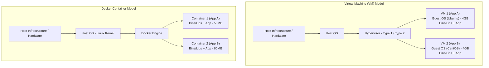
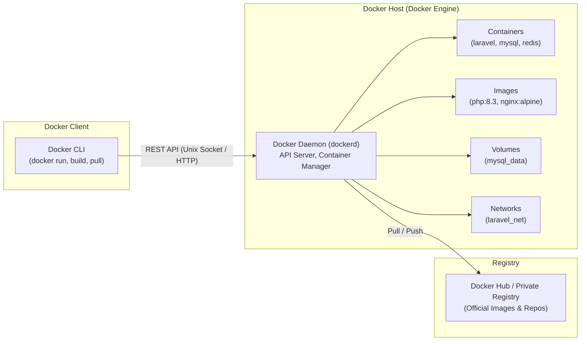

# 🌟 အခန်း (၁) - Docker Fundamentals, Architecture & Engine

---

## ၁။ Docker ဆိုတာ ဘာလဲ? (Docker Fundamentals)

### 📌 ရိုးရှင်းသော ဥပမာဖြင့် စတင်နားလည်ခြင်း
သင်္ဘောကြီးများဖြင့် ကုန်ပစ္စည်းပို့ဆောင်ရာတွင် ပန်းသီး၊ ကားအပိုပစ္စည်း၊ အဝတ်အထည် စသည်တို့ကို အပုံလိုက် တင်ပို့ပါက တစ်ခုနှင့်တစ်ခု ရောထွေးပြီး ပျက်စီးလွယ်ပါသည်။ ထို့ကြောင့် ကုန်သေတ္တာ (**Shipping Container**) ဟူသော စံချိန်မီသေတ္တာများထဲသို့ ထည့်သွင်းသယ်ယူကြသည်။ ထိုသေတ္တာသည် မည်သည့်သင်္ဘော၊ မည်သည့်ရထား၊ မည်သည့်ကုန်တင်ကားပေါ်တွင်မဆို အလွယ်တကူ တင်ဆောင်သွားနိုင်ပါသည်။

**Software လောကတွင်လည်း Docker သည် ထိုသဘောတရားအတိုင်းပင် ဖြစ်သည်။**
Docker သည် သင့် Application (ဥပမာ- PHP/Laravel) နှင့် ၎င်း Application အလုပ်လုပ်ရန် လိုအပ်သော အရာအားလုံး (PHP Runtime, Nginx, Extensions, Composer Libraries, System Packages, Configuration Files) အားလုံးကို **"Container"** ဟုခေါ်သော သီးသန့် ပေါ့ပါးသည့် သေတ္တာလေးထဲသို့ ထုပ်ပိုး (Package) ပေးသည့် Platform ဖြစ်သည်။

```
+-------------------------------------------------------------+
|                     DOCKER CONTAINER                        |
|                                                             |
|   +-----------------------------------------------------+   |
|   |         Laravel Application Source Code             |   |
|   +-----------------------------------------------------+   |
|   |  PHP 8.3 + PHP-FPM + PDO MySQL + Redis Extension    |   |
|   +-----------------------------------------------------+   |
|   |          Linux Base Libraries & Binaries            |   |
|   +-----------------------------------------------------+   |
+-------------------------------------------------------------+
                              |
       (Runs anywhere: Mac, Windows, Linux, AWS, DigitalOcean)
```

---

### ❓ "It works on my machine" ပြဿနာ နှင့် Docker ၏ ဖြေရှင်းချက်

Software Development တွင် အဖြစ်များဆုံး ပြဿနာမှာ-
> *"ကျွန်တော့်စက်ထဲမှာတော့ အကုန် အလုပ်လုပ်တယ်ဗျာ၊ မင်းစက်ထဲရောက်မှ ဘာလို့ Error တက်နေတာလဲ မသိဘူး!"*
> *(သို့မဟုတ် Local မှာ အကောင်း၊ Production Server ပေါ်တင်လိုက်မှ Database extension မရှိတာ၊ PHP version မတူတာ၊ OS configuration ကွဲပြားတာကြောင့် Error တက်ခြင်း)*

**အဘယ်ကြောင့် ထိုသို့ ဖြစ်ရသနည်း?**
- Developer A ၏ စက်တွင် PHP 8.2 ဖြစ်နေပြီး Developer B တွင် PHP 8.3 ဖြစ်နေခြင်း။
- Developer ၏ စက်သည် Mac (macOS) ဖြစ်ပြီး Server သည် Linux (Ubuntu) ဖြစ်နေခြင်း။
- လိုအပ်သော PHP Extensions (ဥပမာ- `gd`, `zip`, `pdo_mysql`) မတူညီခြင်း။

**Docker က မည်သို့ ဖြေရှင်းသနည်း?**
Docker ကို အသုံးပြုလိုက်ပါက Developer စက်၊ Tester စက်၊ Staging Server နှင့် Production Cloud Server အားလုံးတွင် **တူညီသော Docker Image ကိုသာ အသုံးပြုသောကြောင့်** ပတ်ဝန်းကျင် အခြေအနေ (Environment) ၁၀၀% ထပ်တူညီသွားပြီး "It works on my machine" ပြဿနာ လုံးဝ မရှိတော့ပါ။

---

### ⚖️ Virtual Machine (VM) နှင့် Docker Container နှိုင်းယှဉ်ချက်

လူအများစုသည် Docker ကို VirtualBox, VMware ကဲ့သို့ Virtual Machine (VM) နှင့် မှားယွင်း တတ်ကြသည်။ ၎င်းတို့သည် အခြေခံ အလုပ်လုပ်ပုံ လုံးဝ မတူညီပါ။



| အချက်အလက် | Virtual Machine (VM) | Docker Container |
| :--- | :--- | :--- |
| **Operating System** | သီးခြား **Guest OS အပြည့်အစုံ** လိုအပ်သည် (ဥပမာ- Windows ပေါ်တွင် Ubuntu အပြည့် တင်ရသည်) | သီးခြား Guest OS မလိုပါ။ Host OS ၏ **Linux Kernel ကို မျှဝေသုံးစွဲသည်** |
| **Size (အရွယ်အစား)** | GB ပေါင်းများစွာ ကြီးမားသည် (5GB ~ 20GB) | အလွန်သေးငယ်သည် (MB ပမာဏသာ ရှိသည်၊ 20MB ~ 200MB) |
| **Startup Time** | Boot တက်ရန် မိနစ်ပိုင်း ကြာမြင့်သည် | Milliseconds (စက္ကန့်ပိုင်း) အတွင်း ချက်ချင်း စတင်ပွင့်သည် |
| **Resource Usage** | RAM နှင့် CPU ကို ကြိုတင် သတ်မှတ်ဖဲ့ယူထားသည် | လိုအပ်သလောက်သာ Dynamic သုံးစွဲသည် (ပေါ့ပါးသည်) |
| **Isolation အဆင့်** | Hardware level virtualization ဖြစ်၍ အလွန်လုံခြုံသည် | OS Process level isolation ဖြစ်သည် (Namespaces & Cgroups) |

---

## ၂။ Docker Architecture (ဖွဲ့စည်းပုံ စနစ်ကြီး)

Docker သည် **Client-Server Architecture** ပေါ်တွင် အခြေခံ၍ တည်ဆောက်ထားပါသည်။



### ၁။ Docker Client (CLI)
- Developer များ Terminal မှ ရိုက်ထည့်သော `docker run`, `docker build`, `docker compose up` စသည့် Command များ ဖြစ်သည်။
- Client သည် အလုပ်ကို ကိုယ်တိုင် လုပ်ဆောင်ခြင်း မဟုတ်ဘဲ Docker Daemon ဆီသို့ REST API ဖြင့် ညွှန်ကြားချက် ပေးပို့ခြင်းသာ ဖြစ်သည်။

### ၂။ Docker Host (Docker Daemon - `dockerd`)
- နောက်ကွယ်တွင် အမြဲ အလုပ်လုပ်နေသော Background Service ဖြစ်သည်။
- Client ထံမှ Request များကို လက်ခံပြီး Docker Images များ Download ဆွဲခြင်း၊ Container များ ဆောက်ခြင်း၊ Run ပေးခြင်း၊ Network နှင့် Volume များကို စီမံခန့်ခွဲခြင်း စသည်တို့ကို အမှန်တကယ် လုပ်ဆောင်ပေးသည့် ဦးနှောက် ဖြစ်သည်။

### ၃။ Docker Registry
- Docker Image များကို သိမ်းဆည်းရာ ဗဟိုနေရာ ဖြစ်သည်။
- Default အနေဖြင့် အများပြည်သူ သုံးနိုင်သော **Docker Hub** ဖြစ်ပြီး၊ ကုမ္ပဏီများအတွက် AWS ECR, Google Artifact Registry, GitHub Container Registry (ghcr.io) စသည့် Private Registry များကိုလည်း သုံးနိုင်သည်။

---

## ၃။ Docker Engine အတွင်းပိုင်း အလုပ်လုပ်ပုံ (Deep Dive)

Docker Engine ကို အသေးစိတ် လေ့လာပါက အောက်ပါ အဓိက အစိတ်အပိုင်း ၄ ခုဖြင့် အလုပ်လုပ်သည်ကို တွေ့ရမည်-

```
+-------------------------------------------------------+
|               Docker Client (docker CLI)              |
+-------------------------------------------------------+
                           |
                     (REST API)
                           v
+-------------------------------------------------------+
|                 dockerd (Docker Daemon)               |
+-------------------------------------------------------+
                           |
                     (gRPC API)
                           v
+-------------------------------------------------------+
|                 containerd (Supervising)              |
+-------------------------------------------------------+
                  |                   |
                  v                   v
        +-------------------+ +-------------------+
        |  containerd-shim  | |  containerd-shim  |
        +-------------------+ +-------------------+
                  |                   |
                  v                   v
        +-------------------+ +-------------------+
        |   runc (OCI)      | |   runc (OCI)      |
        +-------------------+ +-------------------+
                  |                   |
                  v                   v
          [ Container 1 ]       [ Container 2 ]
```

1. **`dockerd`**: Docker CLI မှ လာသော Command များကို စီမံပြီး Image, Volume, Network များကို ကြီးကြပ်သည်။
2. **`containerd`**: Cloud Native Computing Foundation (CNCF) စံချိန်မီ Container Lifecycle ကို အမှန်တကယ် ထိန်းချုပ်ပေးသော Core Component ဖြစ်သည်။
3. **`runc`**: Linux Kernel နှင့် တိုက်ရိုက် ထိတွေ့ပြီး Container ကို အမှန်တကယ် Create လုပ်ပေးသော OCI (Open Container Initiative) စံချိန်မီ Low-level Runtime ဖြစ်သည်။
4. **`containerd-shim`**: Container တစ်ခုစီကို dockerd နှင့် အဆက်အသွယ်မပြတ်စေရန် ကြားခံပေးပြီး Docker daemon restart ကျသွားသော်လည်း Container များ ဆက်လက် အလုပ်လုပ်နေစေရန် ကာကွယ်ပေးသည်။

### 💡 Linux Kernel နည်းပညာ ၂ ခု (Container ကို ဖြစ်တည်စေသောအရာ)
Container ဆိုသည်မှာ အထူးဆန်းကြီး မဟုတ်ပါ။ Linux OS ၏ အဓိက နည်းပညာ ၂ ခုကို အသုံးချထားခြင်း ဖြစ်သည်-
- **Namespaces (ခွဲထုတ်ခြင်း - Isolation):** Container တစ်ခုနှင့် တစ်ခု Process ID (PID), Network (NET), Mount points (MNT), User IDs (UID) မရောထွေးစေရန် အခန်းကန့်ပေးသည်။
- **Control Groups - Cgroups (ကန့်သတ်ခြင်း - Resource Limiting):** Container တစ်ခုသည် CPU မည်မျှ၊ RAM မည်မျှသာ သုံးရမည်ဟု စည်းကမ်းသတ်မှတ်ပေးသည်။

---

## ၄။ Docker CLI & Basic Commands စတင်စမ်းသပ်ခြင်း

Terminal တွင် Docker မှန်ကန်စွာ အလုပ်လုပ်ခြင်း ရှိ/မရှိ စစ်ဆေးနိုင်သော အခြေခံ Command များ-

```bash
# Docker Client နှင့် Server Version စစ်ဆေးခြင်း
docker version

# Docker စနစ်တစ်ခုလုံး၏ အချက်အလက်များ ကြည့်ရှုခြင်း
docker info

# Docker တွင် ပထမဆုံး စမ်းသပ်သည့် Hello World Container Run ခြင်း
docker run hello-world
```

### 🔍 `docker run hello-world` ရိုက်လိုက်သောအခါ ဘာတွေ ဖြစ်သွားသလဲ?
1. Docker Client သည် Docker Daemon ဆီသို့ `hello-world` image ကို run ရန် တောင်းဆိုသည်။
2. Docker Daemon သည် သင်၏ Local စက်ထဲတွင် `hello-world` image ရှိ/မရှိ စစ်ဆေးသည်။ မရှိသေးပါက Docker Hub မှ အလိုအလျောက် Download (`docker pull`) ဆွဲယူသည်။
3. Download ပြီးသွားသော Image မှ Container အသစ်တစ်ခု တည်ဆောက်ပြီး Run ပေးသည်။
4. Hello world message ကို Terminal တွင် ပြသပြီးနောက် Container သည် အလိုအလျောက် ပိတ် (Exit) သွားသည်။
