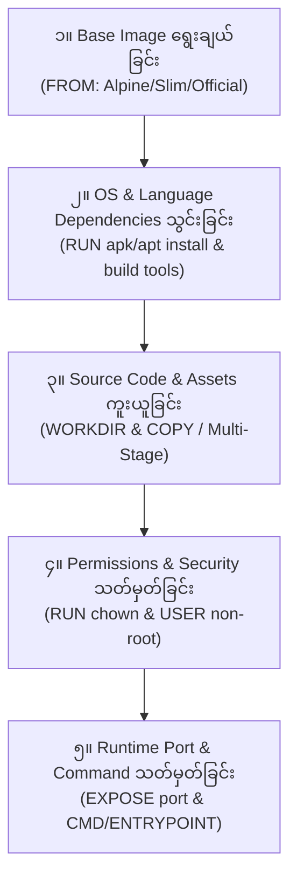

# 🛠️ အခန်း (၃) - Dockerfile & Image Building

---

## ၈။ Dockerfile ဆိုတာ ဘာလဲ? (Dockerfile Instructions)

### 📌 အဓိပ္ပာယ်ဖွင့်ဆိုချက်
`Dockerfile` ဆိုသည်မှာ မိမိ စိတ်ကြိုက် Docker Image တစ်ခုကို အစအဆုံး တည်ဆောက်ရန် Docker Engine အတွက် လိုအပ်သော ညွှန်ကြားချက်များ (Instructions) ကို အဆင့်ဆင့် ရေးသားထားသော Plain Text Configuration ဖိုင် ဖြစ်သည်။

---

### 📜 အရေးကြီးသော Dockerfile Instructions များ အသေးစိတ်

| Instruction | အဓိပ္ပာယ် နှင့် အသုံးပြုပုံ | ဥပမာ |
| :--- | :--- | :--- |
| **`FROM`** | အခြေခံယူမည့် Base Image ကို သတ်မှတ်သည် (Dockerfile တိုင်း၏ ပထမဆုံး လိုင်းဖြစ်ရမည်) | `FROM php:8.3-fpm-alpine` |
| **`WORKDIR`** | Container အတွင်း အလုပ်လုပ်မည့် Working Directory လမ်းကြောင်း သတ်မှတ်သည် (Linux ၏ `cd` နှင့် အလားတူသည်) | `WORKDIR /var/www/html` |
| **`COPY`** | Host စက်ထဲမှ ဖိုင်/ဖိုဒါများကို Container ဖိုင်စနစ်ထဲသို့ ကူးယူသည် | `COPY . /var/www/html` |
| **`ADD`** | `COPY` နှင့် တူသော်လည်း URL မှ ဒေါင်းဆွဲနိုင်ပြီး `.tar.gz` ဖိုင်များကို အလိုအလျောက် ဖြည်ပေးနိုင်သည် (ပုံမှန်အားဖြင့် `COPY` ကိုသာ သုံးသင့်သည်) | `ADD app.tar.gz /var/www/` |
| **`RUN`** | Image တည်ဆောက်ချိန် (Build Time) တွင် Linux Command များကို Run ရန် (ဥပမာ- packages သွင်းခြင်း) | `RUN apk update && apk add git curl` |
| **`ENV`** | Container အတွင်း အမြဲတမ်း တည်ရှိနေမည့် Environment Variable များ သတ်မှတ်သည် | `ENV APP_ENV=production` |
| **`ARG`** | Image Build လုပ်ချိန်တွင်သာ ယာယီအသုံးပြုမည့် Build Variable သတ်မှတ်သည် | `ARG PHP_VERSION=8.3` |
| **`EXPOSE`** | Container အလုပ်လုပ်မည့် Network Port ကို အသိပေး ကြေညာသည် (သတိပြုရန်: အပြင်သို့ အလိုအလျောက် ပွင့်မသွားပါ၊ Documentation သဘောသာ ဖြစ်သည်) | `EXPOSE 9000` |
| **`VOLUME`** | Container ထဲရှိ မည်သည့် folder ကို Data Persistence အတွက် Volume လုပ်မည်ဟု ကြေညာသည် | `VOLUME ["/var/www/html/storage"]` |
| **`USER`** | နောက်ဆက်တွဲ Command များကို Root မဟုတ်ဘဲ မည်သည့် Linux User ဖြင့် Run မည်ကို သတ်မှတ်သည် (လုံခြုံရေးအတွက် သုံးသည်) | `USER www-data` |
| **`CMD`** | Container စတင် Run သည့်အခါ အလုပ်လုပ်မည့် Default Command (ပြင်ပမှ `docker run` flag ဖြင့် အလွယ်တကူ Override လုပ်နိုင်သည်) | `CMD ["php-fpm"]` |
| **`ENTRYPOINT`**| Container စတင်ချိန်တွင် မဖြစ်မနေ Run မည့် ပင်မ Executable Process (ပြင်ပမှ Override လုပ်ရန် ခက်ခဲသည်) | `ENTRYPOINT ["docker-entrypoint.sh"]` |

---

### ⚔️ `CMD` vs `ENTRYPOINT` (မကြာခဏ မှားတတ်သော အကြောင်းအရာ)

- **Shell Form vs Exec Form:**
  - Shell Form: `CMD php-fpm` (Behind the scenes တွင် `/bin/sh -c php-fpm` ဟု Run သဖြင့် PID 1 မဟုတ်ဘဲ Stop signal ကောင်းစွာ မရနိုင်ပါ)။
  - **Exec Form (အကြံပြုသည့် ပုံစံ):** `CMD ["php-fpm"]` (JSON Array format ဖြစ်ပြီး Linux Signal များကို တိုက်ရိုက် လက်ခံနိုင်သည်)။

- **တွဲဖက် အသုံးပြုပုံ (Best Practice):**
  ```dockerfile
  # Container သည် အမြဲတမ်း PHP artisan command ကို အခြေခံထားမည်
  ENTRYPOINT ["php", "artisan"]

  # Default argument မှာ route:list ဖြစ်သော်လည်း အပြင်မှ အခြား argument ပေး၍ ရသည်
  CMD ["route:list"]
  ```
  အကယ်၍ `docker run my-image` ဟု run ပါက `php artisan route:list` ဖြစ်မည်။  
  အကယ်၍ `docker run my-image migrate` ဟု run ပါက `php artisan migrate` ဖြစ်သွားမည်။

---

## ၉။ Docker Build နှင့် Multi-Stage Builds

### 🐘 လက်တွေ့ Laravel Production Dockerfile ဥပမာ

အောက်ပါ Dockerfile သည် Multi-Stage Build နည်းပညာကို သုံး၍ Composer နှင့် Node.js Frontend (Vite) ကို သီးခြား build ပြီး အသေးဆုံး၊ အလုံခြုံဆုံး Production PHP-FPM Image ရရှိအောင် ရေးသားထားခြင်း ဖြစ်သည်-

```dockerfile
# ==========================================
# အဆင့် (၁): Composer Dependencies Build Stage
# ==========================================
FROM composer:2.7 AS composer_build
WORKDIR /app
COPY composer.json composer.lock ./
# Production အတွက် dev package များ မပါဘဲ optimize လုပ်၍ သွင်းခြင်း
RUN composer install --no-dev --optimize-autoloader --no-interaction --no-progress

# ==========================================
# အဆင့် (၂): Frontend Assets Build Stage (Vite/Tailwind)
# ==========================================
FROM node:20-alpine AS node_build
WORKDIR /app
COPY package.json package-lock.json ./
RUN npm ci
COPY resources/ resources/
COPY vite.config.js ./
RUN npm run build

# ==========================================
# အဆင့် (၃): Final Production Image (PHP 8.3 FPM)
# ==========================================
FROM php:8.3-fpm-alpine

# လိုအပ်သော Linux OS level packages များနှင့် PHP Extensions သွင်းခြင်း
RUN apk update && apk add --no-cache \
    curl \
    libpng-dev \
    libzip-dev \
    zip \
    unzip \
    oniguruma-dev

# Laravel အတွက် မရှိမဖြစ် PHP extensions များ တပ်ဆင်ခြင်း
RUN docker-php-ext-install pdo_mysql mbstring gd zip opcache

# အလုပ်လုပ်မည့် directory သတ်မှတ်ခြင်း
WORKDIR /var/www/html

# Source code အားလုံး ကူးယူခြင်း
COPY . /var/www/html

# Stage 1 မှ Vendor libraries နှင့် Stage 2 မှ Built frontend assets များကိုသာ ရွေးကူးခြင်း
COPY --from=composer_build /app/vendor /var/www/html/vendor
COPY --from=node_build /app/public/build /var/www/html/public/build

# Permission ပိုင်း သတ်မှတ်ပေးခြင်း (www-data သို့ လွှဲပြောင်းပေးခြင်း)
RUN chown -R www-data:www-data /var/www/html/storage /var/www/html/bootstrap/cache

# Port 9000 တွင် FastCGI process ဖွင့်လှစ်ခြင်း
EXPOSE 9000

# www-data user ဖြင့်သာ လည်ပတ်စေခြင်း (Security Best Practice)
USER www-data

# Container စတင်ချိန်တွင် PHP-FPM စတင် run မည်
CMD ["php-fpm"]
```

---

### 🔍 Dockerfile တစ်ကြောင်းချင်းစီ၏ အတွင်းသဘော အသေးစိတ် လေ့လာခြင်း (Deep Dive)

အထက်ပါ Dockerfile တွင် တွေ့ရသော လိုင်းများသည် အလွတ်ကျက်ထားခြင်း မဟုတ်ဘဲ Linux OS၊ Application Architecture နှင့် Docker Engine တို့၏ သဘောတရားများပေါ်တွင် အခြေခံထားခြင်း ဖြစ်သည်။ မည်သည့် App/Feature အတွက်မဆို မိမိဘာသာ စဉ်းစားဆုံးဖြတ် ရေးသားနိုင်စေရန် အောက်ပါအတိုင်း အသေးစိတ် လေ့လာပါ-

---

#### ၁။ `apk update && apk add` ဆိုတာ ဘာကြောင့် လိုအပ်ပြီး မည်သည့် Package များ ထည့်ရမည်ကို မည်သို့ သိနိုင်သနည်း?

```dockerfile
RUN apk update && apk add --no-cache \
    curl \
    libpng-dev \
    libzip-dev \
    zip \
    unzip \
    oniguruma-dev
```

##### 💡 အဘယ်ကြောင့် လိုအပ်သနည်း (Why)?
- ကျွန်ုပ်တို့ အသုံးပြုထားသော Base Image သည် `alpine` (အလွန် ပေါ့ပါးသေးငယ်သော Linux OS, ~5MB ခန့်သာရှိသည်) ဖြစ်သည်။
- ထို့ကြောင့် Alpine ထဲတွင် ပုံမှန် Linux တွင် ပါလေ့ရှိသော C-compilers၊ Graphics libraries၊ Compression tools များ မပါဝင်ပါ။
- PHP တွင် ပုံများ resize လုပ်ခြင်း (GD/Image intervention)၊ Zip ဖိုင် ချုံ့ခြင်း/ဖြည်ခြင်း (`zip/unzip`)၊ Regular Expression အလုပ်လုပ်ခြင်း (`mbstring/oniguruma`) စသည့် လုပ်ငန်းများ ဆောင်ရွက်ရန် **Linux OS အဆင့် C-Libraries (`-dev` packages)** များ မဖြစ်မနေ ရှိထားမှသာ နောက်တစ်ဆင့်တွင် PHP Extension အဖြစ် Compile လုပ်၍ တပ်ဆင်နိုင်မည် ဖြစ်သည်။
- `--no-cache` flag သည် package download index cache များကို image ထဲတွင် မကျန်ခဲ့စေရန် ချက်ချင်း ဖျက်ပစ်ပေးသဖြင့် Image Size ကို အသေးဆုံး ဖြစ်စေသည်။

##### 🧠 မည်သည့် Package များ ထည့်ရမည်ကို မည်သို့ သိနိုင်သနည်း (How to know)?
တခြား Feature သို့မဟုတ် တခြား App (Node.js, Python, Go, etc.) တွင် မည်သည့် OS package များ လိုအပ်ကြောင်း သိရှိရန် နည်းလမ်း (၄) မျိုး ရှိပါသည်-

1. **Official Docker Hub Documentation ကို ဖတ်ရှုခြင်း (အဓိက အရင်းအမြစ်):**
   - ဥပမာ- Docker Hub ရှိ [php official repository](https://hub.docker.com/_/php) သို့ သွားဖတ်ပါက PHP Extension တစ်ခုစီတိုင်း (GD, Zip, Mbstring, Intl, Imagick) အတွက် လိုအပ်သော Linux packages စာရင်းကို ဇယားဖြင့် အတိအကျ ဖော်ပြထားပါသည်။
2. **Build Error Logs ကို ကြည့်၍ ရှာဖွေခြင်း (Trial & Error Debugging):**
   - ဥပမာ- `RUN docker-php-ext-install gd` ကို အရင် run ကြည့်လိုက်ပါ။ Error ထွက်လာပါမည်-
     ```text
     configure: error: png.h not found ... Please reinstall the libpng distribution
     ```
   - ထို error ကို မြင်လျှင် `libpng` (သို့မဟုတ် Alpine အတွက် `libpng-dev`) လိုအပ်နေပြီဖြစ်ကြောင်း ချက်ချင်း သိရှိနိုင်သည်။
3. **Application ၏ Official Requirements ကို စစ်ဆေးခြင်း:**
   - ဥပမာ- Laravel Docs ၏ "Server Requirements" တွင် `ext-mbstring`, `ext-gd`, `ext-zip`, `ext-pdo_mysql` လိုအပ်သည်ဟု ရေးထားသည်။
4. **Alpine Linux Package Search Website ကို အသုံးပြုခြင်း:**
   - [pkgs.alpinelinux.org](https://pkgs.alpinelinux.org/packages) တွင် မိမိ လိုအပ်သော library အမည်ကို ရိုက်ရှာနိုင်ပါသည်။ (Ubuntu/Debian အခြေခံ base image ဆိုပါက `apt-get install -y libpng-dev` စသည်ဖြင့် သုံးရမည်)။

---

#### ၂။ `WORKDIR` နှင့် `COPY` ဆိုတာ ပုံသေ Rule လား? တခြား App တွေအတွက် ဘယ်လို သတ်မှတ်မလဲ?

```dockerfile
# အလုပ်လုပ်မည့် directory သတ်မှတ်ခြင်း
WORKDIR /var/www/html

# Source code အားလုံး ကူးယူခြင်း
COPY . /var/www/html
```

##### 💡 ဒါဟာ ပုံသေ Rule (Fixed Rule) လား?
- **မဟုတ်ပါ။ Standard Convention (စံသတ်မှတ်ချက် လမ်းစဉ်) သာ ဖြစ်သည်။**
- မည်သည့် Directory နာမည်မဆို မိမိစိတ်ကြိုက် ပေးခွင့်ရှိသည် (ဥပမာ- `WORKDIR /app`, `WORKDIR /my-awesome-project`)။

##### 🏛️ အဘယ်ကြောင့် `/var/www/html` ကို သုံးရသနည်း?
- Linux Filesystem Hierarchy Standard (FHS) အရ Apache နှင့် Nginx ကဲ့သို့သော Web Server များ၏ Default Document Root သည် ရိုးရာအစဉ်အလာအရ `/var/www/html` ဖြစ်သည်။
- PHP-FPM Official Base Image များတွင်လည်း Default အနေဖြင့် `/var/www/html` ကို အသုံးပြုရန် ကြိုတင် configure လုပ်ထားသောကြောင့် ဤလမ်းကြောင်းကို သုံးခြင်းဖြင့် Configuration များ ပြန်လည် မပြင်ဆင်ရတော့ဘဲ အဆင်ပြေစေပါသည်။

##### 🛠️ တခြား Application များအတွက် အသုံးများသော စံလမ်းကြောင်းများ (Best Practice by Tech Stack):
| Technology / Framework | အသုံးများသော `WORKDIR` | အကြောင်းပြချက် |
| :--- | :--- | :--- |
| **PHP (Laravel, Symfony, WordPress)** | `/var/www/html` သို့မဟုတ် `/var/www` | Nginx/Apache Web Server များ၏ Default Path နှင့် ကိုက်ညီစေရန် |
| **Node.js (Express, Nest, Next.js)** | `/usr/src/app` သို့မဟုတ် `/app` | Node.js Official Docs များတွင် `/usr/src/app` သို့မဟုတ် အတိုကောက် `/app` ကို အသုံးပြုရန် အကြံပြုထားသည် |
| **Python (Django, FastAPI, Flask)** | `/app` သို့မဟုတ် `/workspace` | Standard root directory မရှုပ်ထွေးစေရန် သီးခြား clean directory အဖြစ် ထားရှိခြင်း |
| **Go / Rust (Compiled binaries)** | `/app` (သို့မဟုတ် Scratch image တွင် `/`) | Binary တစ်ခုတည်းသာ run မည်ဖြစ်၍ ရှင်းလင်းသော path ကို ရွေးချယ်ခြင်း |

> [!TIP]
> `WORKDIR` သတ်မှတ်ပြီးပါက နောက်ဆက်တွဲ `COPY` တွင် path အပြည့် ရေးစရာမလိုဘဲ `COPY . .` သို့မဟုတ် `COPY . ./` ဟု ရေးသားနိုင်ပါသည်။
> ```dockerfile
> WORKDIR /var/www/html
> COPY . .
> ```

---

#### ၃။ Multi-Stage Build ၏ `COPY --from` ဘယ်လို အလုပ်လုပ်ပြီး ဘာကြောင့် သုံးသလဲ?

```dockerfile
# Stage 1 မှ Vendor libraries နှင့် Stage 2 မှ Built frontend assets များကိုသာ ရွေးကူးခြင်း
COPY --from=composer_build /app/vendor /var/www/html/vendor
COPY --from=node_build /app/public/build /var/www/html/public/build
```

##### 💡 ဘယ်လို အလုပ်လုပ်သနည်း (How it works)?
- Dockerfile တွင် `FROM ... AS stage_name` ဟု နာမည်ပေးထားသော အဆင့်များမှ ထွက်ပေါ်လာသည့် ဖိုင်များကိုသာ ရွေးထုတ်ကူးယူခြင်း ဖြစ်သည်။
  - Stage 1: `composer:2.7 AS composer_build` တွင် `composer install` ပြီးထွက်လာသော `/app/vendor` ဖိုဒါကို ကူးယူသည်။
  - Stage 2: `node:20-alpine AS node_build` တွင် `npm run build` ပြီးထွက်လာသော `/app/public/build` (compiled css/js) ဖိုဒါကို ကူးယူသည်။
- အဓိပ္ပာယ်မှာ: **Final Production Image ထဲတွင် Composer CLI လည်း မပါဝင်တော့ပါ၊ Node.js runtime လည်း မပါဝင်တော့ပါ၊ `node_modules` (ရာနှင့်ချီသော MB များ) လည်း ပါမလာတော့ပါ။**

##### 🌟 အဘယ်ကြောင့် မဖြစ်မနေ သုံးသင့်သနည်း (Benefits)?
1. **Image Size အလွန် သေးငယ်သွားခြင်း:** Composer နှင့် Node.js ကို Final image တွင် ထည့်သွင်းပါက Image size သည် `800MB ~ 1GB` အထိ ကြီးသွားနိုင်သည်။ Multi-stage build ကြောင့် `80MB ~ 120MB` သာ ရှိတော့မည်။
2. **လုံခြုံရေး (Production Security):** Production Server ပေါ်တွင် `npm`, `composer`, git, C-compilers များ ရှိနေပါက Hacker များအတွက် တိုက်ခိုက်ရန် attack surface ပိုကျယ်စေသည်။ Multi-stage သည် သန့်စင်ပြီးသား Output (Build Artifacts) များကိုသာ တင်ပေးသဖြင့် အလုံခြုံဆုံး ဖြစ်သည်။

##### ❓ မေးလေ့ရှိသော မေးခွန်း: `COPY . /var/www/html` လုပ်ပြီးသားကို ဘာကြောင့် `COPY --from` ပြန်လုပ်သလဲ?
- ကျွန်ုပ်တို့၏ local စက်တွင် `vendor/` နှင့် `public/build/` ဖိုဒါများသည် `.dockerignore` ထဲတွင် ဖယ်ထုတ်ခံထားရလေ့ရှိသည် (သို့မဟုတ် local dev version သာ ရှိနေနိုင်သည်)။
- ထို့ကြောင့် ပထမ `COPY . /var/www/html` ဖြင့် PHP source code များကို အရင်ကူးပြီး၊ Multi-stage မှ build လုပ်ထားသော **Production-ready dependencies & compiled assets** များကို အပေါ်မှ အစားထိုး ထပ်တင် (Overwrite) ပေးခြင်း ဖြစ်သည်။

---

#### ၄။ `chown -R www-data:www-data` ဖိုင် Permissions ဘာကြောင့် သတ်မှတ်ရသနည်း?

```dockerfile
RUN chown -R www-data:www-data /var/www/html/storage /var/www/html/bootstrap/cache
```

##### 💡 ဘာကြောင့် လိုအပ်သနည်း (Why)?
- Dockerfile တွင် `COPY` လုပ်လိုက်သော ဖိုင်များသည် ပုံမှန်အားဖြင့် `root` user ပိုင်ဆိုင်မှုအဖြစ် ရောက်ရှိသွားသည်။
- PHP-FPM process သည် နောက်တစ်ဆင့်တွင် `www-data` အမည်ရှိ သာမန် user အနေဖြင့် လည်ပတ်မည် ဖြစ်သည်။
- Laravel Framework သည် Client များထံမှ ဝင်လာသော Log များ (`storage/logs/laravel.log`)၊ Session များ၊ Upload ဖိုင်များ (`storage/app/public`) နှင့် Route/Config Compiled Cache (`bootstrap/cache`) များကို Disk ပေါ်သို့ အမြဲတမ်း **ဖိုင်အသစ် ရေးသားခြင်း (Write Permission)** ပြုလုပ်ရသည်။
- အကယ်၍ ဤ permissions ကို မပေးခဲ့ပါက Web Application စတင် run ချိန်တွင် `The stream or file ".../laravel.log" could not be opened in append mode: failed to open stream: Permission denied` ဟူသော Error ချက်ချင်း တက်ပါလိမ့်မည်။

---

#### ၅။ `EXPOSE 9000` ဆိုတာ ဘာလဲ? တခြား App တွေရဲ့ Port ကို ဘယ်လို သိနိုင်မလဲ?

```dockerfile
EXPOSE 9000
```

##### 💡 အဓိပ္ပာယ် နှင့် အလုပ်လုပ်ပုံ:
- `EXPOSE 9000` သည် Docker Engine နှင့် Developer အချင်းချင်းအား "ဤ Container သည် Port 9000 တွင် နားထောင်နေသည်" ဟု အသိပေးသော **Documentation Metadata** သာ ဖြစ်သည်။
- ဤ command သည် Host ကွန်ပျူတာ၏ port ကို အပြင်သို့ အလိုအလျောက် ဖွင့်မပေးပါ။ အပြင်သို့ ဖွင့်ရန် `docker run -p 8080:9000` သို့မဟုတ် Docker Compose ၏ `ports:` mapping လိုအပ်သည်။

##### 🧭 တခြား Application များအတွက် မည်သည့် Port ကို ရွေးရမည်နည်း (Port Matrix)?
Framework နှင့် Service တစ်ခုစီတွင် သတ်မှတ်ထားသော Standard Port များ ရှိကြသည်-
| Technology / Service | Default Port | အသုံးပြုပုံ |
| :--- | :--- | :--- |
| **PHP-FPM** | `9000` | FastCGI Protocol (Nginx နှင့် ဆက်သွယ်ရန်) |
| **Nginx / Apache (HTTP)** | `80` | Web Browser များ ဝင်ရောက်ကြည့်ရှုရန် |
| **HTTPS (SSL)** | `443` | Secure Web Traffic |
| **Node.js (Express, Nest)** | `3000` သို့မဟုတ် `5000` | Standard Node Web Server Port |
| **Python (Flask, Django)** | `5000` (Flask), `8000` (Django/FastAPI) | WSGI / ASGI Application Server |
| **MySQL / MariaDB** | `3306` | Database Connection |
| **PostgreSQL** | `5432` | Database Connection |
| **Redis** | `6379` | In-Memory Cache Connection |

---

#### ၆။ `USER www-data` နှင့် `CMD ["php-fpm"]`

```dockerfile
# www-data user ဖြင့်သာ လည်ပတ်စေခြင်း (Security Best Practice)
USER www-data

# Container စတင်ချိန်တွင် PHP-FPM စတင် run မည်
CMD ["php-fpm"]
```

##### 🛡️ `USER www-data` (Security Standard):
- Docker Container များသည် default အားဖြင့် `root` user အဖြစ် run လေ့ရှိသည်။
- အကယ်၍ သင့် Web App ထဲတွင် Remote Code Execution (RCE) ကဲ့သို့သော လုံခြုံရေး အားနည်းချက် (Vulnerability) ရှိခဲ့ပါက Hacker သည် Container တစ်ခုလုံး၏ Root အခွင့်အရေးကို ရရှိသွားနိုင်ပြီး Host စက်ကိုပါ ထိခိုက်စေနိုင်သည်။
- ထို့ကြောင့် Production Dockerfile တိုင်းတွင် အလုပ်လုပ်စရာ Build အဆင့်များ ပြီးဆုံးပါက **Privilege နိမ့်သော User (`www-data`, `node`, `appuser`) သို့ ပြောင်းလဲ run သင့်သည်**။

##### 🚀 `CMD ["php-fpm"]` (Container Execution):
- Container တစ်ခုသည် ၎င်း၏ Main Process (PID 1) အလုပ်လုပ်နေသရွေ့ အသက်ရှင်နေပြီး ထို Process ရပ်တန့်သွားပါက Container လည်း ချက်ချင်း Exit ဖြစ်သွားသည်။
- `CMD ["php-fpm"]` သည် PHP-FPM FastCGI master process ကို Background daemon အဖြစ် မဟုတ်ဘဲ **Foreground process** အဖြစ် run ထားခြင်းဖြင့် Container အမြဲတမ်း အလုပ်လုပ်နေစေရန် ထိန်းကျောင်းပေးခြင်း ဖြစ်သည်။

---

### 🗺️ မည်သည့် Application မဆို Dockerfile ရေးဆွဲရာတွင် လိုက်နာရမည့် ၅ ချက် စည်းမျဉ်း (Universal Mental Model)

အကယ်၍ သင်သည် နောင်အနာဂတ်တွင် Go, Python, React, Spring Boot စသည့် မည်သည့် Project မဆို Dockerfile ရေးရတော့မည်ဆိုပါက အောက်ပါ မေးခွန်း (၅) ခုကိုသာ အစဉ်အတိုင်း စဉ်းစားပါ-



1. **အဆင့် (၁) Base Image:** ငါ့ App အတွက် အသေးဆုံးနှင့် အလုံခြုံဆုံး OS/Runtime က ဘာလဲ? (ဥပမာ- `node:20-alpine`, `python:3.12-slim`, `golang:1.22-alpine`)
2. **အဆင့် (၂) Dependencies:** စက်ထဲမှာ ဘာ Package တွေ အရင်သွင်းရမလဲ? OS အဆင့် library တွေ လိုမလား? Package Manager (npm, pip, composer) cache ကို optimize လုပ်ပြီးပြီလား?
3. **အဆင့် (၃) Code Copy:** Working directory ဘယ်မှာ ထားမလဲ? Build အဆင့်နဲ့ Runtime အဆင့်ကို ခွဲခြားဖို့ Multi-Stage build လိုသလား?
4. **အဆင့် (၄) Security & Permission:** Root အနေနဲ့ run နေမိသလား? User အသစ် သို့မဟုတ် စနစ်သုံး user (node/www-data) သို့ ပြောင်းပြီးပြီလား? Write လုပ်ရမည့် folder တွေကို permission ပေးပြီးပြီလား?
5. **အဆင့် (၅) Process Startup:** App စတင် run ရန် port က ဘာလဲ? Foreground မှာ အမြဲတမ်း run နေမည့် command (`CMD`) က ဘာလဲ?

---

### ⚡ Layer Caching ကို အကောင်းဆုံး အသုံးချနည်း

Docker Image build လုပ်သည့်အခါ အချိန်အကြာဆုံး အဆင့်မှာ `composer install` သို့မဟုတ် `npm install` ဖြစ်သည်။

❌ **မလုပ်သင့်သော ပုံစံ:**
```dockerfile
COPY . .
RUN composer install
```
*(အကြောင်းပြချက်: Source code တစ်ကြောင်း ပြင်လိုက်ရုံနှင့် `COPY . .` လိုင်း ပျက်စီးသွားပြီး `composer install` ကို အစအဆုံး ပြန် run သဖြင့် Build အလွန် ကြာသည်)*

✅ **လုပ်သင့်သော ပုံစံ (Layer Cache Optimization):**
```dockerfile
COPY composer.json composer.lock ./
RUN composer install --no-dev
COPY . .
```
*(အကျိုးကျေးဇူး: `composer.json` မပြောင်းလဲသရွေ့ `composer install` ကို နောက်တစ်ကြိမ် build တိုင်း အစက ပြန်မလုပ်တော့ဘဲ Cache မှ စက္ကန့်ပိုင်းအတွင်း ယူသုံးသည်)*

---

### 🌐 Docker Buildx (Cross-Platform Builds)

ယခုခေတ်တွင် Mac M1/M2/M3/M4 (ARM64) သုံးပြီး Cloud Server သည် Intel/AMD (AMD64) ဖြစ်နေသော အခြေအနေများတွင် `buildx` ဖြင့် Multi-arch image build လုပ်နိုင်ပါသည်-

```bash
# Buildx builder အသစ်တစ်ခု ဆောက်ပြီး သုံးခြင်း
docker buildx create --name mybuilder --use

# AMD64 နှင့် ARM64 နှစ်မျိုးစလုံးအတွက် build ပြီး Docker Hub သို့ တစ်ခါတည်း push လုပ်ခြင်း
docker buildx build --platform linux/amd64,linux/arm64 -t username/laravel-app:1.0 --push .
```
