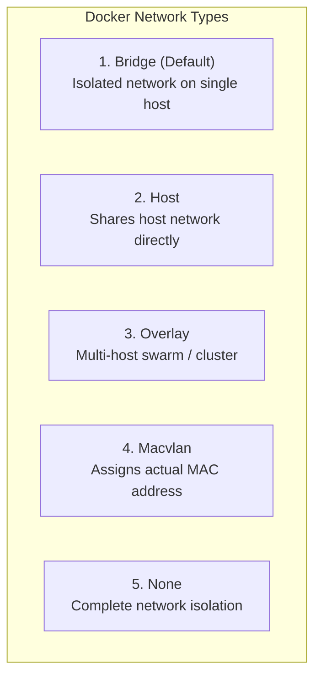

# 🌐 အခန်း (၅) - Networking, Ports & Environment Variables

---

## ၁၂။ Docker Networks (ကွန်ရက် ချိတ်ဆက်မှု စနစ်)

Container များသည် သီးခြား အခန်းခွဲများ (Isolated Environments) ဖြစ်ကြသည်။ Container တစ်ခုနှင့် တစ်ခု ချိတ်ဆက်နိုင်ရန် Docker Networking စနစ်ကို အသုံးပြုသည်။

### 🔌 Docker Network Drivers ၅ မျိုး



1. **Bridge (အသုံးအများဆုံး):**
   - စက်တစ်ခုတည်းပေါ်ရှိ Container များ အချင်းချင်း ဆက်သွယ်ရန် သုံးသည့် Virtual Switch ကဲ့သို့သော ကွန်ရက် ဖြစ်သည်။
2. **Host:**
   - Container သည် သီးသန့် IP မယူတော့ဘဲ Host Machine ၏ Network Interface ကို တိုက်ရိုက် သုံးစွဲသည်။ (အလွန်မြန်သော်လည်း Port မတိုက်မိအောင် သတိထားရသည်)။
3. **Overlay:**
   - Server ပေါင်းများစွာ (Docker Swarm / Multi-host) ပေါ်ရှိ Container အချင်းချင်း ချိတ်ဆက်ရာတွင် သုံးသည်။
4. **Macvlan:**
   - Container အား Router ထံမှ Physical IP တိုက်ရိုက် ရရှိစေရန် MAC address သတ်မှတ်ပေးသည့် စနစ်။
5. **None:**
   - Network လုံးဝ မချိတ်ဆက်ဘဲ အပြင်လောကနှင့် လုံးဝ အဆက်အသွယ် ဖြတ်ထားသည့် စနစ်။

---

### 🧠 Default Bridge vs Custom User-Defined Bridge (အလွန်အရေးကြီးသော ခြားနားချက်)

| အချက်အလက် | Default Bridge Network | Custom User-Defined Bridge |
| :--- | :--- | :--- |
| **ချိတ်ဆက်ပုံ** | Network မသတ်မှတ်ပါက အလိုအလျောက် ရောက်သွားသည် | `docker network create` ဖြင့် ကိုယ်တိုင် ဆောက်ရသည် |
| **DNS Name Resolution** | ❌ **မရပါ** (IP Address ဖြင့်သာ ဆက်သွယ်နိုင်သည်) | ✅ **ရပါသည်** (Container Name ဖြင့် တိုက်ရိုက် ဆက်သွယ်နိုင်သည်) |
| **လုံခြုံရေး** | Container အားလုံး တစ်နေရာတည်း ရောနှောနေသည် | ပရောဂျက်တစ်ခုစီအတွက် သီးခြား ခွဲထုတ်ထားနိုင်သည် |

> [!IMPORTANT]
> Real-world ပရောဂျက်များတွင် အမြဲတမ်း **Custom User-Defined Bridge Network** ကိုသာ အသုံးပြုရမည်။ ထိုအခါမှသာ Laravel App ထဲမှနေ၍ Database ကို `DB_HOST=172.17.0.2` ကဲ့သို့သော ပြောင်းလဲတတ်သည့် IP မသုံးဘဲ `DB_HOST=mysql` ဟူသော Container Name ဖြင့် အမြဲ အဆင်ပြေစွာ လှမ်းချိတ်နိုင်မည် ဖြစ်သည်။

---

### 🛠️ Hands-On: Containers အချင်းချင်း Name ဖြင့် ချိတ်ဆက်ခြင်း

```bash
# အဆင့် ၁: Custom Network အသစ်တစ်ခု ဆောက်ခြင်း
docker network create my-app-network

# အဆင့် ၂: MySQL Container ကို ထို network ထဲတွင် run ခြင်း
docker run -d \
  --name db-service \
  --network my-app-network \
  -e MYSQL_ROOT_PASSWORD=secret \
  mysql:8.0

# အဆင့် ၃: Alpine container တစ်ခုမှ db-service ကို ping စမ်းသပ်ခြင်း
docker run --rm -it --network my-app-network alpine ping -c 3 db-service
```
*(Docker ၏ Internal DNS က `db-service` ဆိုသော နာမည်ကို သက်ဆိုင်ရာ Container IP သို့ အလိုအလျောက် ဖြေရှင်းပေးသွားသည်ကို တွေ့ရမည်)*

---

## ၁၃။ Port Mapping အသေးစိတ် (Port Forwarding)

Container အတွင်းရှိ Application (ဥပမာ- Nginx Port 80) သည် Container အတွင်းပိုင်း၌သာ ပွင့်နေပြီး၊ အပြင်ဘက် သင့်ကွန်ပျူတာ (Host) မှ ကြည့်၍ မရသေးပါ။  
အပြင်ကမ္ဘာမှ လှမ်းဖွင့်နိုင်ရန် **Port Mapping (`-p`)** ပြုလုပ်ပေးရသည်။

```
  Host Machine (Your Laptop)            Docker Container
+----------------------------+       +-------------------+
|  Browser / Client          |       |  Nginx Web Server |
|  http://localhost:8080     |       |                   |
|                            |       |                   |
|  HOST PORT: 8080  ---------[-------]--> CONTAINER: 80 |
+----------------------------+       +-------------------+
          ( -p 8080:80 )
```

### 📌 Port Mapping Syntax
```bash
-p [HOST_IP]:[HOST_PORT]:[CONTAINER_PORT]
```

- **`-p 8080:80`** : Host စက်၏ Port 8080 သို့ ဝင်လာသမျှ Traffic များကို Container ၏ Port 80 ဆီသို့ ပို့ပေးပါ။
- **`-p 127.0.0.1:3306:3306` (Security Tip):** MySQL Database port ကို မိမိ Local machine (`localhost`) တစ်ခုတည်းမှသာ ဝင်ရောက်ခွင့်ပြုပြီး အပြင်ကမ္ဘာ အင်တာနက်မှ တိုက်ရိုက် လှမ်းဝင်၍ မရအောင် ပိတ်ပင်ထားခြင်း ဖြစ်သည်။

### ❓ `EXPOSE` နှင့် `-p (Publish)` ဘာကွာသလဲ?
- `EXPOSE 80` (Dockerfile ထဲတွင် ရေးခြင်း): "ဤ Image သည် Port 80 ကို သုံးပါသည်" ဟု အသိပေးသည့် Documentation သာ ဖြစ်ပြီး Port အမှန်တကယ် ပွင့်မသွားပါ။
- `-p 8080:80` (`docker run` တွင် သုံးခြင်း): အမှန်တကယ် Host OS ၏ Firewall/Iptables တွင် Port ဖွင့်ပြီး ချိတ်ဆက်ပေးခြင်း ဖြစ်သည်။

---

## ၁၄။ Environment Variables (ပတ်ဝန်းကျင် ပြောင်းလဲနိုင်သော တန်ဖိုးများ)

Software Architecture (12-Factor App) အရ Configuration များကို Code ထဲတွင် Hardcode မရေးဘဲ Environment Variables များဖြင့် ထိန်းချုပ်ရမည်။

### 📥 Container ထဲသို့ Env ပေးပို့နည်း ၃ နည်း

#### နည်းလမ်း ၁- Command Line မှ `-e` ဖြင့် တိုက်ရိုက် ပေးခြင်း
```bash
docker run -d \
  --name my-php \
  -e APP_ENV=local \
  -e APP_DEBUG=true \
  php:8.3-fpm
```

#### နည်းလမ်း ၂- File ဖြင့် `--env-file` ပေးပို့ခြင်း (Laravel `.env` အတွက် အသုံးများဆုံး)
```bash
docker run -d \
  --name my-laravel \
  --env-file .env \
  my-laravel-image
```

#### နည်းလမ်း ၃- Dockerfile ထဲတွင် Default တန်ဖိုး `ENV` ဖြင့် ကြေညာထားခြင်း
```dockerfile
ENV APP_ENV=production
ENV DB_PORT=3306
```

### 🛡️ လုံခြုံရေး သတိပြုချက် (Secrets Management)
Database Password များနှင့် API Secret Key များကို Dockerfile ထဲတွင် `ENV DB_PASSWORD=secret` ဟု ဘယ်တော့မှ မရေးရပါ။ Image ကို ကြည့်နိုင်သူတိုင်း `docker history` သို့မဟုတ် `docker inspect` ဖြင့် Password ကို မြင်တွေ့သွားနိုင်သောကြောင့် ဖြစ်သည်။ Environment Variables သို့မဟုတ် Docker Secrets ကိုသာ သုံးရပါမည်။
