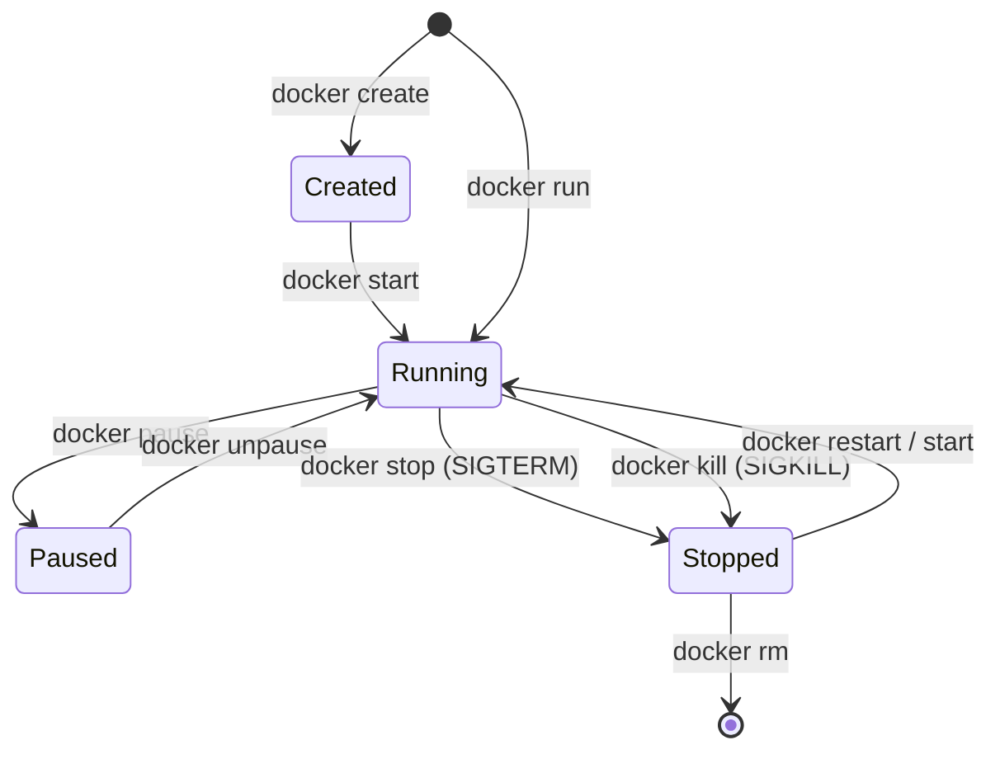

# 🛡️ အခန်း (၈) - Container Lifecycle, Debugging & Security

---

## ၂၃။ Container Lifecycle (ဘဝသံသရာ စက်ဝန်း)

Container တစ်ခုသည် မွေးဖွားချိန်မှ စတင်ကာ ပျက်စီးသွားချိန်အထိ အောက်ပါ State များကို ဖြတ်သန်းရသည်-



### 🛑 Graceful Shutdown vs Force Kill
- **`docker stop`**: Container အတွင်းရှိ Process သို့ `SIGTERM` signal အရင် ပို့ပေးသည်။ Application အား လက်ရှိ အလုပ်လုပ်နေသော Database Transactions များနှင့် HTTP Requests များကို အပြီးသတ် သိမ်းဆည်းရန် စက္ကန့် ၁၀ (Default) အချိန်ပေးသည်။ အချိန်မီ မရပ်ပါကမှ `SIGKILL` ဖြင့် အပြီးသတ် ရပ်တန့်သည်။
- **`docker kill`**: စောင့်ဆိုင်းခြင်း မရှိဘဲ ချက်ချင်း `SIGKILL` ဖြင့် process ကို ရပ်ပစ်သဖြင့် Database Data Corruption ဖြစ်နိုင်ချေ ရှိသည်။

---

## ၂၄။ Logs & Debugging (ပြဿနာ ရှာဖွေဖြေရှင်းခြင်း)

Docker Container များတွင် Error တက်သည့်အခါ အောက်ပါ Tools များကို အသုံးပြု၍ စနစ်တကျ Debug လုပ်ရပါမည်-

### ၁။ Live Logs စောင့်ကြည့်ခြင်း
```bash
# Laravel Container ၏ Real-time logs ကို နောက်ဆုံး စာကြောင်း ၅၀ မှ စတင်ကြည့်ခြင်း
docker logs -f --tail 50 laravel-app

# Timestamps (အချိန်နာရီ) ပါ ထည့်ပြရန်
docker logs -tf laravel-app
```

### ၂။ Container အတွင်းသို့ တိုက်ရိုက် ဝင်ရောက် စစ်ဆေးခြင်း
```bash
# Container ထဲသို့ Bash/Sh shell ဖွင့်၍ ဝင်ခြင်း
docker exec -it laravel-app sh

# Container အတွင်း Network ချိတ်ဆက်မှု စစ်ဆေးခြင်း (ဥပမာ- MySQL သို့ ပေါက်/မပေါက်)
nc -zv mysql 3306
```

### ၃။ Resource ပြဿနာ ရှာဖွေခြင်း (CPU / Memory Leaks)
```bash
# Live CPU & RAM Usage Monitor
docker stats

# Container အတွင်း အလုပ်လုပ်နေသော Process စာရင်း ကြည့်ခြင်း
docker top laravel-app
```

### ၄။ Low-level Inspection ဖြင့် IP Address ရှာဖွေခြင်း
```bash
# Container ၏ IP Address သီးသန့် ထုတ်ယူခြင်း
docker inspect --format='{{range .NetworkSettings.Networks}}{{.IPAddress}}{{end}}' laravel-app
```

### ၅။ ဖိုင်စနစ် ပြောင်းလဲမှုများကို စစ်ဆေးခြင်း (`docker diff`)
```bash
docker diff laravel-app
# A = Added, C = Changed, D = Deleted
```

---

## ၂၅။ Docker Security (လုံခြုံရေး မဟာဗျူဟာများ)

Container လုံခြုံရေးသည် Production ပတ်ဝန်းကျင်တွင် အလွန် အရေးကြီးပါသည်။

### ၁။ Root User အဖြစ် ဘယ်တော့မှ မ Run ပါနှင့် (Principle of Least Privilege)
Container အတွင်း Root user (`UID 0`) အဖြစ် Run ထားပါက Hacker သည် Application ပေါက်ကြားမှု (Vulnerability) မှတစ်ဆင့် Container Breakout ပြုလုပ်ကာ Host OS တစ်ခုလုံးကို ထိန်းချုပ်သွားနိုင်ပါသည်။

```dockerfile
# Dockerfile ထဲတွင် သာမန် User သို့ ပြောင်းပါ
USER www-data
```

### ၂။ Resource Limits များ သတ်မှတ်ပါ (DoS Attack ကာကွယ်ခြင်း)
Container တစ်ခုက Memory သို့မဟုတ် CPU အကုန်လုံးကို ဝါးမျိုမသွားစေရန် ကန့်သတ်ရပါမည်-

```yaml
services:
  php:
    image: laravel-app
    deploy:
      resources:
        limits:
          cpus: '1.5'
          memory: 512M
        reservations:
          memory: 256M
```

### ၃။ Read-Only Filesystem သုံးပါ
Application Code များကို Hacker က လာရောက် မပြင်ဆင်နိုင်စေရန် Root Filesystem ကို Read-Only လုပ်ပြီး Upload/Cache လိုအပ်သော folder များကိုသာ tmpfs/volume အဖြစ် ဖွင့်ပေးပါ:

```yaml
services:
  php:
    read_only: true
    tmpfs:
      - /tmp
```

### ၄။ Docker Scout ဖြင့် Vulnerability Scan စစ်ဆေးခြင်း
```bash
docker scout cves php:8.3-fpm-alpine
```
*(သင့် Docker Image ထဲတွင် CVE Security Vulnerabilities များ ပါရှိနေခြင်း ရှိ/မရှိ အလိုအလျောက် စစ်ဆေးပေးသည်)*
