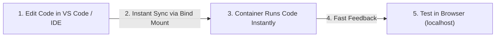

# 🚀 အခန်း (၉) - Development Workflow, Production, Optimization & Best Practices

---

## ၂၆။ Docker Development Workflow (Local Development စနစ်)

Local Development လုပ်ဆောင်ရာတွင် အဆင်ပြေ အချောမွေ့ဆုံး ဖြစ်စေမည့် Workflow မှာ အောက်ပါအတိုင်း ဖြစ်သည်-



### 📋 နေ့စဉ် လုပ်ငန်းဆောင်ရွက်မှု အဆင့်များ:
1. **စတင်အလုပ်လုပ်ခြင်း:** `docker compose up -d` ဖြင့် Service အားလုံးကို တစ်ပြိုင်နက် နိုးထစေသည်။
2. **Composer Package အသစ်သွင်းခြင်း:**
   ```bash
   docker compose exec php composer require guzzlehttp/guzzle
   ```
3. **Database Migration လုပ်ခြင်း:**
   ```bash
   docker compose exec php php artisan migrate
   ```
4. **Code ပြင်ဆင်ခြင်း:** Local VS Code တွင် Save လိုက်သည်နှင့် Bind Mount ကြောင့် Container အတွင်း ချက်ချင်း အကျိုးသက်ရောက်ပြီး Browser တွင် Refresh လုပ်ရုံဖြင့် စမ်းသပ်နိုင်သည်။
5. **အလုပ်သိမ်းဆည်းခြင်း:** `docker compose stop` ဖြင့် ခေတ္တ ပိတ်ထားနိုင်သည်။

---

## ၂၇။ Production Concepts (Production သို့ တင်ခြင်းဆိုင်ရာ သဘောတရားများ)

Local Development နှင့် Production Environment သည် လိုအပ်ချက်ချင်း လုံးဝ မတူညီပါ-

| အချက်အလက် | Local Development | Production Environment |
| :--- | :--- | :--- |
| **Source Code** | Bind Mount သုံးသည် (ချက်ချင်း ပြင်နိုင်ရန်) | Image ထဲသို့ အပြီးသတ် `COPY` လုပ်ထည့်ထားသည် |
| **Dependencies** | Dev packages များ ပါဝင်သည် (Pest, Faker) | `--no-dev` ဖြင့် Production packages သာ သွင်းသည် |
| **OPcache** | Code ချက်ချင်း မပြောင်းနိုင်၍ ပိတ်ထားသည် | စွမ်းဆောင်ရည် အမြင့်ဆုံးရရန် ဖွင့်ထားသည် |
| **Debug Mode** | `APP_DEBUG=true` | `APP_DEBUG=false` (မဖြစ်မနေ ပိတ်ရမည်) |
| **Image Tags** | `:latest` သို့မဟုတ် local build | `:v1.2.3` (Immutable Specific Versions) |

---

## ၂၈။ Docker Optimization (Image Size ချုံ့ခြင်းနှင့် အမြန်နှုန်းမြှင့်တင်ခြင်း)

### ၁။ `.dockerignore` ကို မဖြစ်မနေ အသုံးပြုပါ
Image Build လုပ်ချိန်တွင် မလိုအပ်သော ဧရာမ Folder များ Build Context ထဲသို့ မရောက်သွားစေရန် `.dockerignore` ဖိုင် ဆောက်ရပါမည်-

```text
# .dockerignore
.git
.github
node_modules
vendor
.env
.env.*
tests
storage/logs/*.log
storage/framework/cache/*
storage/framework/sessions/*
storage/framework/views/*
```

---

### ၂။ Base Image ရွေးချယ်မှု (Alpine Linux)
- `php:8.3-fpm` (Ubuntu/Debian အခြေခံ) -> **~450 MB**
- `php:8.3-fpm-alpine` (Alpine အခြေခံ) -> **~85 MB** (၅ ဆ ပိုမို ပေါ့ပါးသည်)

---

### ၃။ RUN Instructions များကို ပေါင်းစပ်ပြီး Cache ဖျက်ပါ
❌ **မကောင်းသော ပုံစံ:**
```dockerfile
RUN apk update
RUN apk add curl
RUN apk add zip
```
*(Layer ၃ ခု ဖြစ်သွားပြီး နေရာ ပိုယူသည်)*

✅ **အကောင်းဆုံး ပုံစံ:**
```dockerfile
RUN apk add --no-cache curl zip
```
*(`--no-cache` သည် အင်တာနက်မှ ဒေါင်းလုဒ်ဆွဲထားသော ယာယီ package files များကို ချက်ချင်း အလိုအလျောက် ရှင်းလင်းပစ်သဖြင့် Layer size အလွန် သေးငယ်သွားသည်)*

---

### ၄။ Laravel Production Performance Caching
Production Dockerfile သို့မဟုတ် Entrypoint Script ထဲတွင် Laravel ၏ Cache Commands များကို ကြိုတင် Run ထားရပါမည်-
```bash
php artisan config:cache
php artisan route:cache
php artisan view:cache
```

---

## ၂၉။ Docker Best Practices (ကျွမ်းကျင်သူများ လိုက်နာသော စည်းမျဉ်းများ)

1. **One Process Per Container (ကွန်တိန်နာ တစ်ခုတွင် Process တစ်ခုသာ):**
   Nginx, PHP, MySQL သုံးခုစလုံးကို Container တစ်ခုတည်းထဲ မရောထည့်ပါနှင့်။ Nginx သီးသန့်၊ PHP သီးသန့်၊ MySQL သီးသန့် ခွဲထုတ်ထားမှသာ Scaling နှင့် Debugging လုပ်ရ လွယ်ကူမည်။
2. **Never Use `:latest` in Production:**
   Base Image ဖြစ်စေ၊ ကိုယ်ပိုင် Image ဖြစ်စေ `php:8.3.4-fpm-alpine3.19` ကဲ့သို့ တိကျသော Version ကိုသာ သုံးပါ။ `:latest` သုံးထားပါက နောက်တစ်ကြိမ် Deploy လုပ်ချိန်တွင် Version အသစ် အလိုအလျောက် ဝင်လာပြီး Code Crash ဖြစ်သွားနိုင်သည်။
3. **Use Multi-Stage Builds:**
   Composer နှင့် Node.js Build Tool များကို အပြီးသတ် Production Image ထဲအထိ မသယ်ဆောင်ပါနှင့်။
4. **Use Healthchecks:**
   Container သည် Run နေသော်လည်း Application အတွင်းပိုင်း Hang ဖြစ်နေခြင်း ရှိ/မရှိ စစ်ဆေးရန် `healthcheck` အမြဲ သုံးပါ။
5. **Treat Containers as Disposable (နွားတစ်ကောင်လို မပြုစုပါနှင့်၊ ပန်းကန်ပြားကဲ့သို့ သဘောထားပါ):**
   Container ထဲတွင် ပြင်ဆင်မှုများ ကိုယ်တိုင် လက်ဖြင့် ဝင်မလုပ်ပါနှင့်။ အသစ်လိုပါက Container အဟောင်းကို ဖြိုချပြီး Dockerfile မှ အသစ် ပြန်ဆောက်ယူသော ယဉ်ကျေးမှုကို ကျင့်သုံးပါ။
