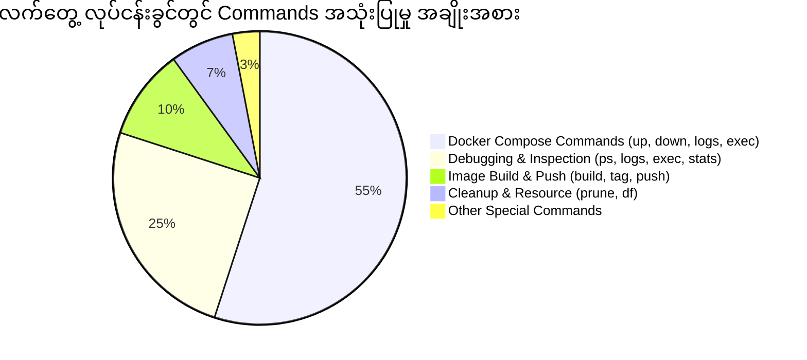

# 📖 Docker & Docker Compose Commands Reference Guide (မြန်မာဘာသာ)

ဤဖိုင်တွင် Docker CLI နှင့် Docker Compose command တိုင်းကို အောက်ပါ Rule အတိုင်း စနစ်တကျ အသေးစိတ် ရှင်းလင်းပေးထားပါသည်-
1. **ရည်ရွယ်ချက် (Purpose & What it does)**
2. **Syntax (ပုံစံ)**
3. **အသုံးများသော Flag များ (Common Options/Flags)**
4. **လက်တွေ့ အသုံးပြုပုံ ဥပမာ (Real-World Practical Example)**
5. **ရလဒ်နှင့် ရှင်းလင်းချက် (Output & Detailed Explanation)**

---

## 📑 မာတိကာ (Table of Contents)

1. [Docker System & Information Commands](#1-docker-system--information-commands)
2. [Docker Registry & Authentication Commands](#2-docker-registry--authentication-commands)
3. [Docker Image Management Commands](#3-docker-image-management-commands)
4. [Docker Build & Buildx Commands](#4-docker-build--buildx-commands)
5. [Docker Container Lifecycle Commands](#5-docker-container-lifecycle-commands)
6. [Docker Monitoring, Inspection & Debugging Commands](#6-docker-monitoring-inspection--debugging-commands)
7. [Docker Execution, File Transfer & Import/Export](#7-docker-execution-file-transfer--importexport)
8. [Docker Volume Management Commands](#8-docker-volume-management-commands)
9. [Docker Network Management Commands](#9-docker-network-management-commands)
10. [Docker Compose Commands](#10-docker-compose-commands)
11. [Modern Advanced Commands (Watch, Context, Update, Events)](#11-modern-advanced-commands)
12. [လက်တွေ့ လုပ်ငန်းခွင်တွင် အများဆုံး သုံးသော Top Commands များ (Real-World Daily Drivers 80/20 Rule)](#12-လက်တွေ့-လုပ်ငန်းခွင်တွင်-အများဆုံး-သုံးသော-top-commands-များ)
13. [ဒါတွေက Docker Command အားလုံးပဲလား? (Command Hierarchy & Anatomy)](#13-ဒါတွေက-docker-command-အားလုံးပဲလား)

---

## 1. Docker System & Information Commands

### `docker version`
- **ရည်ရွယ်ချက်:** သင်၏စက်ထဲတွင် သွင်းထားသော Docker Client နှင့် Docker Server (Daemon) ၏ Version အချက်အလက်များ၊ Git commit၊ Go version နှင့် OS/Arch တို့ကို ကြည့်ရှုရန် အသုံးပြုသည်။
- **Syntax:**
  ```bash
  docker version [OPTIONS]
  ```
- **အသုံးများသော Options:**
  - `--format` : Output ကို Go template / JSON format ဖြင့် ထုတ်ယူရန် (ဥပမာ- `docker version --format '{{.Server.Version}}'`)
- **Real-World Example:**
  ```bash
  docker version
  ```
- **ရှင်းလင်းချက်:**
  Client အပိုင်းသာမက Docker Daemon (Server) ပါ အလုပ်လုပ်နေခြင်း ရှိ/မရှိ ဤ command ဖြင့် ချက်ချင်း သိရှိနိုင်သည်။ Server မ run ထားပါက `Cannot connect to the Docker daemon` ဟု ပြပါမည်။

---

### `docker info`
- **ရည်ရွယ်ချက်:** Docker Engine ၏ တစ်ခုလုံးဆိုင်ရာ အသေးစိတ် အခြေအနေ (System-wide Information) ကို ကြည့်ရှုရန်။ Total containers အရေအတွက် (running, paused, stopped), Image အရေအတွက်, Storage Driver, Cgroup Driver, CPU, RAM စသည်တို့ကို ပြသပေးသည်။
- **Syntax:**
  ```bash
  docker info [OPTIONS]
  ```
- **Real-World Example:**
  ```bash
  docker info
  ```
- **ရှင်းလင်းချက်:**
  Production server သို့မဟုတ် Local machine တွင် Docker အတွက် CPU ဘယ်လောက်၊ Memory ဘယ်လောက် သတ်မှတ်ပေးထားသလဲ၊ Storage driver (overlay2) မှန်ကန်မှု ရှိ/မရှိ စစ်ဆေးရာတွင် မဖြစ်မနေ အသုံးပြုရသည်။

---

### `docker help`
- **ရည်ရွယ်ချက်:** Docker commands များနှင့် ပတ်သက်သော အကူအညီနှင့် အသုံးပြုပုံ (Help documentation) ကို command line ထဲတွင် ဖတ်ရှုရန်။
- **Syntax:**
  ```bash
  docker help [COMMAND]
  # သို့မဟုတ်
  docker [COMMAND] --help
  ```
- **Real-World Example:**
  ```bash
  docker run --help
  ```
- **ရှင်းလင်းချက်:**
  Command တစ်ခု၏ ရနိုင်သော flags များကို အင်တာနက် မလိုဘဲ terminal တွင် တိုက်ရိုက် ကြည့်ရှုရန် အလွန် အသုံးဝင်သည်။

---

### `docker system df`
- **ရည်ရွယ်ချက်:** Docker က သင့် Hard Drive ထဲတွင် နေရာ (Disk space) မည်မျှ သုံးစွဲထားသည်ကို Images, Containers, Local Volumes နှင့် Build Cache တစ်ခုချင်းစီအလိုက် ရှင်းလင်းစွာ ပြသပေးသည်။
- **Syntax:**
  ```bash
  docker system df [OPTIONS]
  ```
- **Options:**
  - `-v, --verbose` : Image, Container တစ်ခုချင်းစီ ဘယ်လောက်ယူထားသည်ကို အသေးစိတ် ကြည့်ရန်။
- **Real-World Example:**
  ```bash
  docker system df
  ```
- **Output ရှင်းလင်းချက်:**
  `RECLAIMABLE` ကော်လံကို ကြည့်ခြင်းအားဖြင့် မသုံးတော့သည့် Container/Image များကို ဖျက်လိုက်ပါက Disk space မည်မျှ ပြန်ရနိုင်မည်ကို သိရှိနိုင်သည်။

---

### `docker system prune`
- **ရည်ရွယ်ချက်:** မလိုအပ်တော့သော (အသုံးမပြုတော့သော Stopped containers, Dangling images, Unused networks နှင့် Build caches) အားလုံးကို တစ်ချက်တည်းဖြင့် Clean-up လုပ်ပြီး Disk space ပြန်လည် ရယူရန်။
- **Syntax:**
  ```bash
  docker system prune [OPTIONS]
  ```
- **Options:**
  - `-a, --all` : Stopped container က အသုံးမပြုသော image အားလုံးကိုပါ ဖျက်ပစ်ရန်။
  - `--volumes` : အသုံးမပြုတော့သော Anonymous volumes များကိုပါ ဖျက်ရန်။
  - `-f, --force` : Confirmation မတောင်းဘဲ တိုက်ရိုက် ဖျက်ရန်။
- **Real-World Example:**
  ```bash
  docker system prune -a --volumes -f
  ```
- **သတိပြုရန်:** Production ပတ်ဝန်းကျင်တွင် စဉ်းစားပြီးမှသာ သုံးသင့်သည်။ Volume ထဲတွင် data အရေးကြီးပါက သီးသန့် backup ယူထားရမည်။

---

## 2. Docker Registry & Authentication Commands

### `docker login`
- **ရည်ရွယ်ချက်:** Docker Hub သို့မဟုတ် Private Container Registry (AWS ECR, GitHub Packages `ghcr.io`, GitLab Registry) သို့ အကောင့်ဝင်ရန်။
- **Syntax:**
  ```bash
  docker login [OPTIONS] [SERVER]
  ```
- **Options:**
  - `-u, --username` : Username
  - `-p, --password` : Password သို့မဟုတ် Personal Access Token (PAT)
- **Real-World Example:**
  ```bash
  # Docker Hub အတွက်
  docker login -u myusername

  # GitHub Container Registry အတွက်
  docker login ghcr.io -u github_username
  ```

---

### `docker logout`
- **ရည်ရွယ်ချက်:** ချိတ်ဆက်ထားသော Registry မှ Sign out လုပ်ပြီး လုံခြုံရေးအရ စက်ထဲရှိ Token/Credential များကို ဖျက်ပစ်ရန်။
- **Syntax:**
  ```bash
  docker logout [SERVER]
  ```
- **Real-World Example:**
  ```bash
  docker logout
  ```

---

### `docker search`
- **ရည်ရွယ်ချက်:** Docker Hub ပေါ်ရှိ Public Image များကို Terminal ထဲမှ တိုက်ရိုက် ရှာဖွေရန်။
- **Syntax:**
  ```bash
  docker search [OPTIONS] TERM
  ```
- **Options:**
  - `--filter "is-official=true"` : Official image များကိုသာ ရွေးရှာရန်။
  - `--limit N` : ပြသမည့် အရေအတွက် ကန့်သတ်ရန် (Default: 25)။
- **Real-World Example:**
  ```bash
  docker search --filter "is-official=true" --limit 5 php
  ```

---

### `docker pull`
- **ရည်ရွယ်ချက်:** Docker Hub သို့မဟုတ် Remote Registry တစ်ခုခုမှ Image ကို Local စက်ထဲသို့ Download ဆွဲယူရန်။
- **Syntax:**
  ```bash
  docker pull [OPTIONS] NAME[:TAG|@DIGEST]
  ```
- **Real-World Example:**
  ```bash
  docker pull php:8.3-fpm-alpine
  docker pull mysql:8.0
  ```
- **ရှင်းလင်းချက်:** Tag မထည့်ပေးပါက Docker သည် default အနေဖြင့် `:latest` tag ကို ဆွဲယူမည် ဖြစ်သည်။

---

### `docker push`
- **ရည်ရွယ်ချက်:** Local စက်တွင် တည်ဆောက်ထားသော Custom Docker Image ကို Docker Hub သို့မဟုတ် Private Registry သို့ Upload တင်ရန်။
- **Syntax:**
  ```bash
  docker push [OPTIONS] NAME[:TAG]
  ```
- **Real-World Example:**
  ```bash
  docker tag my-laravel-app:v1.0 myusername/my-laravel-app:v1.0
  docker push myusername/my-laravel-app:v1.0
  ```

---

## 3. Docker Image Management Commands

### `docker images` / `docker image ls`
- **ရည်ရွယ်ချက်:** Local machine တွင် ဒေါင်းလုဒ်ဆွဲထားသော သို့မဟုတ် Build လုပ်ထားသော Docker Images စာရင်းကို ကြည့်ရှုရန်။
- **Syntax:**
  ```bash
  docker images [OPTIONS] [REPOSITORY[:TAG]]
  ```
- **Options:**
  - `-a, --all` : Intermediate images အားလုံးကိုပါ ကြည့်ရန်။
  - `-q, --quiet` : Image IDs များကိုသာ ထုတ်ယူရန် (Scripting တွင် အလွန်သုံးသည်)။
- **Real-World Example:**
  ```bash
  docker images
  ```

---

### `docker image inspect`
- **ရည်ရွယ်ချက်:** Image တစ်ခု၏ အသေးစိတ် အချက်အလက်များ (Layers, Environment Variables, Exposed Ports, Default Entrypoint, OS Architecture စသည်) ကို JSON format ဖြင့် အသေးစိတ် ကြည့်ရှုရန်။
- **Syntax:**
  ```bash
  docker image inspect IMAGE_NAME[:TAG]
  ```
- **Real-World Example:**
  ```bash
  docker image inspect nginx:alpine
  ```

---

### `docker image history`
- **ရည်ရွယ်ချက်:** Image တစ်ခုကို တည်ဆောက်ခဲ့စဉ်က Dockerfile အဆင့်ဆင့် (Layers) များနှင့် Layer တစ်ခုချင်းစီ၏ Size ကို ပြန်လည် စစ်ဆေးရန်။
- **Syntax:**
  ```bash
  docker image history [OPTIONS] IMAGE
  ```
- **Real-World Example:**
  ```bash
  docker image history php:8.3-fpm
  ```
- **ရှင်းလင်းချက်:** Image Size ကြီးနေပါက မည်သည့် layer က MB အများဆုံး ယူထားသည်ကို ရှာဖွေရန် အလွန် အသုံးဝင်သည်။

---

### `docker tag`
- **ရည်ရွယ်ချက်:** Image တစ်ခုကို နာမည်အသစ် သို့မဟုတ် Version Tag အသစ် သတ်မှတ်ပေးရန် (Registry သို့ Push မလုပ်မီ မဖြစ်မနေ သုံးရသည်)။
- **Syntax:**
  ```bash
  docker tag SOURCE_IMAGE[:TAG] TARGET_IMAGE[:TAG]
  ```
- **Real-World Example:**
  ```bash
  docker tag laravel-app:latest kyawwaiyan/laravel-app:1.0.0
  ```

---

### `docker image rm` (သို့မဟုတ် `docker rmi`)
- **ရည်ရွယ်ချက်:** မလိုလားအပ်သော Local Docker Image များကို ဖျက်ပစ်ရန်။
- **Syntax:**
  ```bash
  docker image rm [OPTIONS] IMAGE [IMAGE...]
  ```
- **Options:**
  - `-f, --force` : Container တစ်ခုခုက သုံးနေသော်လည်း ဇွတ်အတင်း ဖျက်ရန်။
- **Real-World Example:**
  ```bash
  docker image rm nginx:alpine
  ```

---

### `docker image prune`
- **ရည်ရွယ်ချက်:** Tag မရှိတော့သော Dangling images (`<none>:<none>`) များကို ရှင်းထုတ်ရန်။
- **Syntax:**
  ```bash
  docker image prune [OPTIONS]
  ```
- **Options:**
  - `-a, --all` : Container များနှင့် မချိတ်ဆက်ထားသော Image အားလုံးကို ဖျက်ရန်။
- **Real-World Example:**
  ```bash
  docker image prune -f
  ```

---

### `docker save` နှင့် `docker load`
- **ရည်ရွယ်ချက်:**
  - `docker save` : Docker Image ကို `.tar` file အဖြစ် Export ထုတ်ရန် (အင်တာနက်မရှိသော Offline Server သို့ ကူးယူရန်)။
  - `docker load` : ထို `.tar` file ကို Docker Image အဖြစ် ပြန်လည် သွင်းယူရန်။
- **Syntax & Real-World Example:**
  ```bash
  # Image ကို tar file ထုတ်ခြင်း
  docker save -o my-laravel-app.tar my-laravel-app:v1.0

  # အခြား server တစ်ခုတွင် tar file ကို ပြန်သွင်းခြင်း
  docker load -i my-laravel-app.tar
  ```

---

## 4. Docker Build & Buildx Commands

### `docker build`
- **ရည်ရွယ်ချက်:** `Dockerfile` ထဲတွင် ရေးသားထားသော ညွှန်ကြားချက်များအတိုင်း Docker Image အသစ်တစ်ခု တည်ဆောက်ရန်။
- **Syntax:**
  ```bash
  docker build [OPTIONS] PATH | URL
  ```
- **အသုံးများသော Options:**
  - `-t, --tag` : Image နာမည်နှင့် Tag ပေးရန် (ဥပမာ- `-t my-app:1.0`)
  - `-f, --file` : အခြား အမည်ရှိသော Dockerfile ကို ညွှန်ပြရန် (ဥပမာ- `-f Dockerfile.prod`)
  - `--no-cache` : ယခင် build cache များကို မသုံးဘဲ အစမှ ပြန်လည် build လုပ်ရန်
  - `--build-arg` : Dockerfile ထဲရှိ `ARG` သို့ တန်ဖိုး ပေးပို့ရန်
- **Real-World Example:**
  ```bash
  docker build -t laravel-app:latest .
  docker build --no-cache -t laravel-app:v2 -f Dockerfile.prod .
  ```
- **ရှင်းလင်းချက်:** နောက်ဆုံးက အစက် `.` သည် လက်ရှိ directory (Build Context) ကို ကိုယ်စားပြုသည်။

---

### `docker buildx build`
- **ရည်ရွယ်ချက်:** Multi-Architecture Images (ဥပမာ- Apple Silicon `linux/arm64` နှင့် Cloud Linux Server `linux/amd64` နှစ်မျိုးစလုံးတွင် run နိုင်သော Image) တည်ဆောက်ရန်။
- **Syntax:**
  ```bash
  docker buildx build [OPTIONS] PATH
  ```
- **Options:**
  - `--platform` : Target platform များ သတ်မှတ်ရန် (ဥပမာ- `linux/amd64,linux/arm64`)
  - `--push` : Build ပြီးသည်နှင့် Registry သို့ တိုက်ရိုက် push တင်ရန်
- **Real-World Example:**
  ```bash
  docker buildx build --platform linux/amd64,linux/arm64 -t kyawwaiyan/laravel-app:v1.0 --push .
  ```

---

## 5. Docker Container Lifecycle Commands

### `docker create`
- **ရည်ရွယ်ချက်:** Image တစ်ခုမှ Container အသစ်တစ်ခုကို ဆောက်ထားသော်လည်း ချက်ချင်း မ Run ဘဲ 'Created' အခြေအနေဖြင့် ထားရှိရန်။
- **Syntax:**
  ```bash
  docker create [OPTIONS] IMAGE [COMMAND] [ARG...]
  ```
- **Real-World Example:**
  ```bash
  docker create --name my-redis-cache redis:alpine
  ```

---

### `docker run` (⭐️ အရေးအကြီးဆုံး Command)
- **ရည်ရွယ်ချက်:** Image တစ်ခုမှ Container အသစ်ကို Create လုပ်ပြီး ချက်ချင်း Start (Run) လုပ်ရန်။
- **Syntax:**
  ```bash
  docker run [OPTIONS] IMAGE [COMMAND] [ARG...]
  ```
- **မဖြစ်မနေ သိရမည့် Flags များ:**
  - `-d, --detach` : Background (daemon) အနေဖြင့် run ရန် (Terminal မပိတ်ဘဲ နောက်ကွယ်တွင် အလုပ်လုပ်နေစေရန်)
  - `-p, --publish` : Host Port နှင့် Container Port ကို ချိတ်ဆက်ရန် (ဥပမာ- `-p 8080:80`)
  - `--name` : Container အား မှတ်မိလွယ်သော နာမည်ပေးရန်
  - `-v, --volume` : Volume သို့မဟုတ် Bind mount ချိတ်ဆက်ရန် (ဥပမာ- `-v /host/path:/container/path`)
  - `-e, --env` : Environment Variable ပေးပို့ရန် (ဥပမာ- `-e APP_ENV=production`)
  - `--env-file` : `.env` file တစ်ခုလုံးကို တိုက်ရိုက် ထည့်သွင်းရန်
  - `--network` : Container အား မည်သည့် Docker Network ထဲ ထည့်မည်ကို သတ်မှတ်ရန်
  - `--restart` : Crash ဖြစ်ပါက သို့မဟုတ် Docker restart ဖြစ်ပါက အလိုအလျောက် ပြန် run စေရန် (ဥပမာ- `--restart unless-stopped`)
  - `-it` : Interactive terminal mode ဖြင့် bash/sh ထဲ ချက်ချင်း ဝင်ရောက်ရန်
  - `--rm` : Container ရပ်တန့် (Exit) သွားသည်နှင့် အလိုအလျောက် Container ကို ဖျက်ပစ်ရန်
- **Real-World Examples:**
  ```bash
  # Background Nginx container run ခြင်း
  docker run -d --name my-web-server -p 8080:80 nginx:alpine

  # MySQL Database container volume နှင့် root password ဖြင့် run ခြင်း
  docker run -d \
    --name mysql-db \
    -p 3306:3306 \
    -e MYSQL_ROOT_PASSWORD=secret \
    -e MYSQL_DATABASE=laravel_db \
    -v mysql_data:/var/lib/mysql \
    --restart unless-stopped \
    mysql:8.0

  # Interactive mode ဖြင့် Ubuntu container ထဲ ဝင်စမ်းခြင်း
  docker run --rm -it ubuntu:22.04 bash
  ```

---

### `docker start`, `docker stop`, `docker restart`
- **ရည်ရွယ်ချက်:**
  - `docker stop` : Run နေသော Container ကို Graceful shutdown (`SIGTERM`) ဖြင့် ပုံမှန် ရပ်တန့်ရန်။
  - `docker start` : Stopped ဖြစ်နေသော Container ကို ပြန်လည် Run ရန်။
  - `docker restart` : Container ကို ရပ်ပြီး ချက်ချင်း ပြန်ဖွင့်ရန်။
- **Real-World Example:**
  ```bash
  docker stop my-web-server
  docker start my-web-server
  docker restart my-web-server
  ```

---

### `docker pause` နှင့် `docker unpause`
- **ရည်ရွယ်ချက်:**
  - `docker pause` : Linux `cgroups freezer` ကို သုံး၍ Container ၏ Process အားလုံးကို ခေတ္တ အေးခဲ (Freeze) ထားရန် (CPU အသုံးမပြုတော့ဘဲ Memory ပေါ်တွင် အခြေအနေအတိုင်း တည်ရှိနေမည်)။
  - `docker unpause` : ခေတ္တရပ်ထားသော Container ကို ပြန်လည် ဆက်လက် လည်ပတ်စေရန်။
- **Real-World Example:**
  ```bash
  docker pause mysql-db
  docker unpause mysql-db
  ```

---

### `docker kill`
- **ရည်ရွယ်ချက်:** Container ကို Graceful shutdown မစောင့်တော့ဘဲ ချက်ချင်း ချက်ချင်း အင်အားသုံး ရပ်တန့်ရန် (`SIGKILL` ပို့သည်)။
- **Real-World Example:**
  ```bash
  docker kill stuck-container
  ```

---

### `docker rm`
- **ရည်ရွယ်ချက်:** ရပ်တန့်ထားသော (Stopped) Container များကို စက်ထဲမှ ဖျက်ပစ်ရန်။
- **Options:**
  - `-f, --force` : Run နေသော Container ကို အတင်းရပ်ပြီး ချက်ချင်း ဖျက်ရန်။
  - `-v` : Container နှင့် တွဲနေသော anonymous volume များကိုပါ ဖျက်ရန်။
- **Real-World Example:**
  ```bash
  docker rm my-web-server
  # Stopped container အားလုံး တစ်ပြိုင်နက် ဖျက်ခြင်း
  docker rm $(docker ps -a -q)
  ```

---

### `docker rename`
- **ရည်ရွယ်ချက်:** Container တစ်ခု၏ နာမည်ကို အသစ် ပြောင်းလဲရန်။
- **Real-World Example:**
  ```bash
  docker rename old-app-name new-app-name
  ```

---

### `docker update`
- **ရည်ရွယ်ချက်:** Run နေသော Container ၏ Resource limit (CPU, Memory, Restart policy) များကို Container မဖျက်ဘဲ Dynamic ပြင်ဆင်ရန်။
- **Real-World Example:**
  ```bash
  docker update --memory 1024m --cpus 1.5 my-web-server
  docker update --restart unless-stopped mysql-db
  ```

---

## 6. Docker Monitoring, Inspection & Debugging Commands

### `docker ps` နှင့် `docker ps -a`
- **ရည်ရွယ်ချက်:**
  - `docker ps` : လက်ရှိ Run နေသော (Active) Containers များကို ကြည့်ရန်။
  - `docker ps -a` : ရပ်တန့်နေသော (Stopped / Exited) Containers များအပါအဝင် အားလုံးကို ကြည့်ရန်။
- **Options:**
  - `-q` : Container IDs များကိုသာ ထုတ်ပြရန်။
  - `--filter "status=exited"` : Filter ဖြင့် ရှာဖွေရန်။
- **Real-World Example:**
  ```bash
  docker ps
  docker ps -a
  ```

---

### `docker inspect`
- **ရည်ရွယ်ချက်:** Container သို့မဟုတ် Image သို့မဟုတ် Volume သို့မဟုတ် Network ၏ Low-level configuration အချက်အလက်အားလုံး (IP Address, Mount paths, Env vars, State, MAC address) ကို JSON ဖြင့် အသေးစိတ် ကြည့်ရှုရန်။
- **Real-World Example:**
  ```bash
  # Container IP Address ကို တိုက်ရိုက် ထုတ်ယူခြင်း
  docker inspect --format='{{range .NetworkSettings.Networks}}{{.IPAddress}}{{end}}' my-web-server
  ```

---

### `docker stats`
- **ရည်ရွယ်ချက်:** Run နေသော Container များ၏ CPU %, Memory Usage, Memory %, Network I/O, Block I/O (Disk) တို့ကို Live Real-time Resource Monitor ပြသပေးသည်။
- **Real-World Example:**
  ```bash
  docker stats
  docker stats --no-stream # တစ်ကြိမ်သာ Snapshot ထုတ်ကြည့်ခြင်း
  ```

---

### `docker top`
- **ရည်ရွယ်ချက်:** Container တစ်ခုအတွင်း လည်ပတ်နေသော Linux OS level processes (PID, User, Command) များကို ကြည့်ရန်။
- **Real-World Example:**
  ```bash
  docker top my-web-server
  ```

---

### `docker port`
- **ရည်ရွယ်ချက်:** Container တစ်ခု၏ မည်သည့် Container Port သည် Host Machine ၏ မည်သည့် Port သို့ Map လုပ်ထားသည်ကို ကြည့်ရန်။
- **Real-World Example:**
  ```bash
  docker port my-web-server
  # Output ဥပမာ: 80/tcp -> 0.0.0.0:8080
  ```

---

### `docker diff`
- **ရည်ရွယ်ချက်:** Container စတင် run ချိန်မှစ၍ Container file system ထဲတွင် မည်သည့် file များ အသစ်ထည့်ထားသလဲ (A - Added)၊ မည်သည့် file ပြင်ထားသလဲ (C - Changed)၊ မည်သည့် file ဖျက်ထားသလဲ (D - Deleted) ကို စစ်ဆေးရန်။
- **Real-World Example:**
  ```bash
  docker diff my-web-server
  ```

---

### `docker events`
- **ရည်ရွယ်ချက်:** Docker Engine ပေါ်တွင် ဖြစ်ပျက်နေသော Real-time events များ (Container start, die, kill, volume attach စသည်) ကို Live စောင့်ကြည့်ရန်။
- **Real-World Example:**
  ```bash
  docker events
  ```

---

### `docker logs`
- **ရည်ရွယ်ချက်:** Container အတွင်းရှိ Application (Laravel, Nginx, MySQL စသည်) မှ ထွက်လာသော `stdout` နှင့် `stderr` logs များကို ကြည့်ရှုရန်။
- **အသုံးများသော Options:**
  - `-f, --follow` : Real-time streaming log ကြည့်ရန် (Live log tailing)
  - `--tail N` : နောက်ဆုံး N လိုင်းသာ ကြည့်ရန် (ဥပမာ- `--tail 100`)
  - `-t, --timestamps` : Log ထွက်သည့် အချိန် နာရီပါ ထည့်ပြရန်
- **Real-World Example:**
  ```bash
  docker logs -f --tail 50 my-web-server
  ```

---

## 7. Docker Execution, File Transfer & Import/Export

### `docker exec` (⭐️ Debugging တွင် အသုံးအများဆုံး)
- **ရည်ရွယ်ချက်:** လက်ရှိ Run နေသော Container အတွင်းသို့ ဝင်ရောက်ပြီး Command များ ရိုက်ထည့်ရန် (သို့မဟုတ် Bash Terminal ဖွင့်ရန်)။
- **Options:**
  - `-it` : Interactive Pseudo-TTY ဖွင့်ရန် (Terminal ဝင်ရန် မဖြစ်မနေ လိုသည်)
  - `-u, --user` : Root သို့မဟုတ် အခြား User အနေဖြင့် ဝင်ရန် (ဥပမာ- `-u www-data`)
- **Real-World Examples:**
  ```bash
  # Laravel Container အတွင်းသို့ Bash shell ဖြင့် ဝင်ရောက်ခြင်း
  docker exec -it my-laravel-app bash

  # Container အပြင်ဘက်မှနေ၍ Laravel Artisan command လှမ်း run ခြင်း
  docker exec -it my-laravel-app php artisan migrate --seed
  docker exec -it my-laravel-app php artisan cache:clear
  ```

---

### `docker attach`
- **ရည်ရွယ်ချက်:** Container ၏ Main Process (PID 1) ၏ Standard Input/Output သို့ တိုက်ရိုက် တွဲဆက် (attach) လုပ်ရန်။
- **သတိပြုရန်:** `Ctrl + C` နှိပ်လိုက်ပါက Container တစ်ခုလုံးပါ ရပ်တန့်သွားမည် ဖြစ်သည်။ (ထွက်လိုပါက `Ctrl + P`, `Ctrl + Q` တွဲနှိပ်ရသည်)။ Debugging အတွက် `docker exec` ကို ပို၍ အကြံပြုသည်။

---

### `docker cp`
- **ရည်ရွယ်ချက်:** Host Machine နှင့် Container ကြားတွင် File သို့မဟုတ် Folder များကို ကူးယူ (Copy) ရန်။
- **Syntax:**
  ```bash
  docker cp [OPTIONS] SRC_PATH DEST_PATH
  ```
- **Real-World Examples:**
  ```bash
  # Host မှ ဖိုင်ကို Container ထဲ ကူးထည့်ခြင်း
  docker cp ./default.conf my-nginx:/etc/nginx/conf.d/default.conf

  # Container ထဲမှ Laravel error log ကို Host စက်ထဲ ကူးထုတ်ခြင်း
  docker cp my-laravel-app:/var/www/html/storage/logs/laravel.log ./local-laravel.log
  ```

---

### `docker commit`
- **ရည်ရွယ်ချက်:** ပြင်ဆင်ပြောင်းလဲထားသော Container တစ်ခု၏ အခြေအနေကို Image အသစ်တစ်ခုအဖြစ် Save လုပ်ရန်။
- **Real-World Example:**
  ```bash
  docker commit -m "installed curl and vim" my-web-server my-custom-nginx:v1
  ```

---

### `docker export` နှင့် `docker import`
- **ရည်ရွယ်ချက်:**
  - `docker export` : Container တစ်ခုလုံး၏ File System အား tar file အဖြစ် ထုတ်ယူရန်။
  - `docker import` : ထို File System tar file မှ Image အဖြစ် ပြန်ပြောင်းရန်။
- **Real-World Example:**
  ```bash
  docker export my-laravel-app > laravel-container-fs.tar
  cat laravel-container-fs.tar | docker import - my-imported-laravel:v1
  ```

---

## 8. Docker Volume Management Commands

### `docker volume create`
- **ရည်ရွယ်ချက်:** Docker မှ စီမံခန့်ခွဲသော Persistent Named Storage Volume အသစ်တစ်ခု ဆောက်ရန်။
- **Syntax:**
  ```bash
  docker volume create [OPTIONS] [VOLUME_NAME]
  ```
- **Real-World Example:**
  ```bash
  docker volume create mysql_database_data
  ```

---

### `docker volume ls`
- **ရည်ရွယ်ချက်:** စက်ထဲရှိ Volume အားလုံးစာရင်းကို ကြည့်ရန်။
- **Real-World Example:**
  ```bash
  docker volume ls
  ```

---

### `docker volume inspect`
- **ရည်ရွယ်ချက်:** Volume ၏ အချက်အလက်များ၊ အထူးသဖြင့် Host Machine ၏ မည်သည့် Path (`Mountpoint`) တွင် တကယ် သိမ်းထားသည်ကို ကြည့်ရန်။
- **Real-World Example:**
  ```bash
  docker volume inspect mysql_database_data
  ```

---

### `docker volume rm`
- **ရည်ရွယ်ချက်:** အသုံးမလိုတော့သော Volume တစ်ခုကို ဖျက်ရန်။ (မည်သည့် Container ကမျှ သုံးမနေမှသာ ဖျက်၍ ရမည်)။
- **Real-World Example:**
  ```bash
  docker volume rm mysql_database_data
  ```

---

### `docker volume prune`
- **ရည်ရွယ်ချက်:** မည်သည့် Container ကမျှ ချိတ်ဆက် အသုံးမပြုတော့သော Volume (Dangling volumes) အားလုံးကို တစ်ခါတည်း အကုန်ရှင်းပစ်ရန်။
- **Real-World Example:**
  ```bash
  docker volume prune -f
  ```

---

## 9. Docker Network Management Commands

### `docker network create`
- **ရည်ရွယ်ချက်:** Container များ အချင်းချင်း Container Name ဖြင့် DNS resolution အသုံးပြုကာ ဆက်သွယ်နိုင်စေရန် Custom Network (Default: `bridge`) တစ်ခု တည်ဆောက်ရန်။
- **Syntax:**
  ```bash
  docker network create [OPTIONS] NETWORK_NAME
  ```
- **Options:**
  - `-d, --driver` : Network driver ရွေးရန် (`bridge`, `overlay`, `macvlan`)
- **Real-World Example:**
  ```bash
  docker network create laravel-network
  ```

---

### `docker network ls`
- **ရည်ရွယ်ချက်:** စက်ထဲရှိ Docker Networks စာရင်း အားလုံးကို ကြည့်ရှုရန်။
- **Real-World Example:**
  ```bash
  docker network ls
  ```

---

### `docker network inspect`
- **ရည်ရွယ်ချက်:** အဆိုပါ Network ထဲတွင် မည်သည့် Subnet, Gateway ရှိသလဲ၊ မည်သည့် Container များ ချိတ်ဆက်ထားပြီး IP address ဘယ်လောက် အသီးသီး ရရှိထားသလဲကို ကြည့်ရှုရန်။
- **Real-World Example:**
  ```bash
  docker network inspect laravel-network
  ```

---

### `docker network connect` နှင့် `docker network disconnect`
- **ရည်ရွယ်ချက်:** Run နေသော Container တစ်ခုကို Network အသစ်တစ်ခုထဲသို့ Dynamic ထည့်သွင်းခြင်း သို့မဟုတ် ချိတ်ဆက်မှု ဖြုတ်ပစ်ခြင်း။
- **Real-World Example:**
  ```bash
  # laravel-app ကို redis-network ထဲ ထပ်ချိတ်ခြင်း
  docker network connect redis-network my-laravel-app

  # ဖြုတ်ပစ်ခြင်း
  docker network disconnect redis-network my-laravel-app
  ```

---

### `docker network rm` နှင့် `docker network prune`
- **ရည်ရွယ်ချက်:**
  - `docker network rm` : အသုံးမပြုတော့သော Network တစ်ခုကို ဖျက်ရန်။
  - `docker network prune` : မည်သည့် Container မှ အသုံးမပြုတော့သော မလိုအပ်သည့် Networks အားလုံးကို ရှင်းပစ်ရန်။
- **Real-World Example:**
  ```bash
  docker network rm laravel-network
  docker network prune -f
  ```

---

## 10. Docker Compose Commands

Docker Compose သည် Multi-container applications (ဥပမာ- Nginx + Laravel PHP + MySQL + Redis) များကို `docker-compose.yml` ဖိုင်တစ်ခုတည်းဖြင့် တစ်ပြိုင်နက် စီမံခန့်ခွဲသည့် Tool ဖြစ်သည်။

### `docker compose version`
- **ရည်ရွယ်ချက်:** Docker Compose Plugin ၏ version ကို စစ်ဆေးရန်။
- **Real-World Example:**
  ```bash
  docker compose version
  ```

---

### `docker compose up` နှင့် `docker compose up -d`
- **ရည်ရွယ်ချက်:** `docker-compose.yml` ထဲရှိ Service အားလုံးကို Build လုပ်ခြင်း၊ Network/Volume များ ဆောက်ခြင်းနှင့် Container များကို စတင် Run ပေးခြင်း။
- **Options:**
  - `-d` : Detached mode (Background တွင် Run စေရန် - အသုံးအများဆုံး)
  - `--build` : Image များကို မဖြစ်မနေ အသစ် ပြန်လည် Rebuild လုပ်စေရန်
- **Real-World Example:**
  ```bash
  docker compose up -d
  docker compose up -d --build
  ```

---

### `docker compose down`
- **ရည်ရွယ်ချက်:** `docker compose up` ဖြင့် ဖွင့်ထားသော Containers, Networks များကို အကုန် ရပ်တန့်ပြီး ဖျက်သိမ်းပေးရန်။
- **Options:**
  - `-v, --volumes` : Compose ထဲတွင် ကြေညာထားသော Named Volumes များကိုပါ တစ်ခါတည်း ဖျက်ရန် (Database data အသစ် စတင်လိုသည့်အခါ သုံးသည်)။
- **Real-World Example:**
  ```bash
  docker compose down
  docker compose down -v
  ```

---

### `docker compose start`, `docker compose stop`, `docker compose restart`
- **ရည်ရွယ်ချက်:** Compose services များကို Container မဖျက်ဘဲ ခေတ္တ ရပ်တန့်ရန်၊ ပြန်လည် စတင်ရန် သို့မဟုတ် Restart ချရန်။
- **Real-World Example:**
  ```bash
  docker compose stop
  docker compose start
  docker compose restart php
  ```

---

### `docker compose ps`
- **ရည်ရွယ်ချက်:** လက်ရှိ Compose stack ထဲတွင် ပါဝင်သော Containers များ၏ အခြေအနေ၊ Ports များနှင့် Status ကို စစ်ဆေးရန်။
- **Real-World Example:**
  ```bash
  docker compose ps
  ```

---

### `docker compose logs` နှင့် `docker compose logs -f`
- **ရည်ရွယ်ချက်:** Compose stack ထဲရှိ Services အားလုံး၏ Logs များကို တပြိုင်နက်တည်း ကြည့်ရှုရန်။ Service နာမည် သတ်မှတ်ပေးပါက ထို Service တစ်ခုတည်း၏ Log ကို ကြည့်နိုင်သည်။
- **Real-World Example:**
  ```bash
  # Services အားလုံး၏ Log ကို Live စောင့်ကြည့်ခြင်း
  docker compose logs -f

  # PHP service log တစ်ခုတည်းကိုသာ ကြည့်ခြင်း
  docker compose logs -f php
  ```

---

### `docker compose exec`
- **ရည်ရွယ်ချက်:** Compose ထဲတွင် Run နေသော Service Container ထဲသို့ ဝင်ရောက် Command ရိုက်ရန်။
- **Real-World Example:**
  ```bash
  # Laravel App ထဲသို့ ဝင်ရောက်ပြီး migration run ခြင်း
  docker compose exec php php artisan migrate
  docker compose exec php composer install
  ```

---

### `docker compose run`
- **ရည်ရွယ်ချက်:** Service တစ်ခုအတွက် One-off (တစ်ကြိမ်တည်း သုံးမည့်) Task Container အသစ် run ရန် (ဥပမာ- Test run ခြင်း သို့မဟုတ် npm build လုပ်ခြင်း)။
- **Real-World Example:**
  ```bash
  docker compose run --rm node npm run build
  ```

---

### `docker compose build`
- **ရည်ရွယ်ချက်:** `docker-compose.yml` ထဲရှိ `build:` ပါဝင်သော Services များကို Image အဖြစ် Build လုပ်ရန်။
- **Options:**
  - `--no-cache` : Cache မသုံးဘဲ build ရန်။
- **Real-World Example:**
  ```bash
  docker compose build --no-cache
  ```

---

### `docker compose pull` နှင့် `docker compose push`
- **ရည်ရွယ်ချက်:** Compose ဖိုင်ထဲရှိ Service images များကို Registry မှ ကြိုတင် ဒေါင်းလုဒ် ဆွဲခြင်း သို့မဟုတ် Build ထားသော custom images များကို Registry သို့ Push လုပ်ခြင်း။
- **Real-World Example:**
  ```bash
  docker compose pull
  docker compose push
  ```

---

### `docker compose config`
- **ရည်ရွယ်ချက်:** `docker-compose.yml` ၏ Syntax မှန်ကန်မှု ရှိ/မရှိ စစ်ဆေးရန် (Validate) နှင့် Environment variables များ နေရာဝင်သွားပြီးနောက် နောက်ဆုံး ထွက်ပေါ်လာသော Compose configuration အပြည့်အစုံကို Preview ကြည့်ရန်။
- **Real-World Example:**
  ```bash
  docker compose config
  ```

---

### `docker compose images`
- **ရည်ရွယ်ချက်:** Compose services များက အသုံးပြုထားသော Docker Images များ၏ အမည်၊ Tag နှင့် Size တို့ကို ကြည့်ရန်။
- **Real-World Example:**
  ```bash
  docker compose images
  ```

---

### `docker compose top`
- **ရည်ရွယ်ချက်:** Compose Services များ အားလုံးထဲတွင် မည်သည့် OS level processes များ အလုပ်လုပ်နေသည်ကို ကြည့်ရန်။
- **Real-World Example:**
  ```bash
  docker compose top
  ```

---

### `docker compose cp`
- **ရည်ရွယ်ချက်:** Host machine နှင့် Compose service container တစ်ခုခုကြား File ကူးယူရန်။
- **Real-World Example:**
  ```bash
  docker compose kill
  docker compose rm -f
  ```

---

### `docker compose start`, `docker compose stop` နှင့် `docker compose restart`
- **ရည်ရွယ်ချက်:** Containers များကို မဖျက်ဘဲ ရပ်တန့်ခြင်း၊ ပြန်လည်စတင်ခြင်း သို့မဟုတ် Restart လုပ်ခြင်း။
- **Real-World Example:**
  ```bash
  docker compose stop php
  docker compose start php
  docker compose restart nginx
  ```

---

## 11. Modern Advanced Commands (Watch, Context, Update, Events)

### `docker compose watch` (Hot-Reloading in Docker Compose v2.22+)
- **ရည်ရွယ်ချက်:** Local စက်ထဲရှိ Code များ ပြင်ဆင်မှုကို အချိန်နှင့်တစ်ပြေးညီ စောင့်ကြည့်ပြီး Container ထဲသို့ အလိုအလျောက် Sync ပြုလုပ်ပေးခြင်း သို့မဟုတ် Service ကို အလိုအလျောက် Rebuild လုပ်ပေးခြင်း။
- **Syntax & Real-World Example:**
  ```bash
  docker compose watch
  ```
- **အလုပ်လုပ်ပုံနှင့် အကျိုးသက်ရောက်မှု (Effect):**
  `compose.yaml` တွင် `develop.watch` သတ်မှတ်ထားပါက File တစ်ခု Save လိုက်သည်နှင့် Container ထဲသို့ ချက်ချင်း Sync ရောက်သွားသဖြင့် Local Development Speed ကို အဆမတန် မြန်ဆန်စေသည်။

---

### `docker context` (Multi-Environment Remote Docker Management)
- **ရည်ရွယ်ချက်:** Local Docker မှနေ၍ Remote Cloud Server (AWS EC2, DigitalOcean, Staging) ပေါ်ရှိ Docker Daemon သို့ SSH ဖြင့် တိုက်ရိုက် ပြောင်းလဲ ထိန်းချုပ်ရန်။
- **Syntax:**
  ```bash
  docker context ls
  docker context create <context-name> --docker "host=ssh://user@server-ip"
  docker context use <context-name>
  ```
- **Real-World Example:**
  ```bash
  # Remote Server သို့ ချိတ်ဆက်သည့် context ဆောက်ခြင်း
  docker context create production-server --docker "host=ssh://ubuntu@54.254.12.34"

  # Production Docker သို့ ပြောင်းလဲ ထိန်းချုပ်ခြင်း
  docker context use production-server

  # ယခုအခါ docker ps ဟု ရိုက်ပါက Production Server ပေါ်ရှိ Containers များကို မြင်ရမည်
  docker ps
  ```

---

### `docker update` (Live Resource Limit Adjustments)
- **ရည်ရွယ်ချက်:** Container ကို Stop လုပ်စရာ မလိုဘဲ အလုပ်လုပ်နေစဉ် (Runtime) တွင် CPU နှင့် Memory Limit များကို Dynamic ပြောင်းလဲ သတ်မှတ်ရန်။
- **Real-World Example:**
  ```bash
  docker update --memory 2g --cpus 2.0 laravel-app
  ```
- **Effect:** Container မရပ်တန့်သွားဘဲ RAM limit ကို 2GB သို့ ချက်ချင်း တိုးမြှင့်ပေးသည်။

---

### `docker events` (Real-Time Daemon Monitoring)
- **ရည်ရွယ်ချက်:** Docker Engine အတွင်း ဖြစ်ပျက်နေသော အဖြစ်အပျက်များ (Container create, start, die, kill, network connect) ကို Streaming Live စောင့်ကြည့်ရန်။
- **Real-World Example:**
  ```bash
  docker events --filter 'type=container'
  ```

---

### `docker wait` (CI/CD Pipeline Automation)
- **ရည်ရွယ်ချက်:** Container တစ်ခု အလုပ်လုပ်ပြီး ရပ်တန့်သွားသည်အထိ စောင့်ဆိုင်းပြီး ၎င်း၏ Exit Code (0 = အောင်မြင်၊ 1 = ကျရှုံး) ကို ရယူရန်။
- **Real-World Example:**
  ```bash
  docker wait migration-runner
  ```

---

## 12. လက်တွေ့ လုပ်ငန်းခွင်တွင် အများဆုံး သုံးသော Top Commands များ (Real-World Daily Drivers 80/20 Rule)

ကုမ္ပဏီများ၊ Startups များနှင့် Software House များတွင် နေ့စဉ် အလုပ်လုပ်ရာ၌ Docker Command ပေါင်း ၇၀ ကျော်လုံးကို နေ့တိုင်း မသုံးကြပါ။ **၈၀/၂၀ စည်းမျဉ်း (Pareto Principle)** အရ အောက်ဖော်ပြပါ **Top 18 Commands** သည် နေ့စဉ် လုပ်ငန်းခွင်၏ ၉၅% ကို လွှမ်းခြုံထားပါသည်-



---

### 🏆 နေ့စဉ် မဖြစ်မနေ အသုံးပြုရသော Top 18 Commands အသေးစိတ် ရှင်းလင်းချက်

| No | Command | Effect (ဘာဖြစ်သွားသလဲ) | ဘယ်အချိန်မှာ သုံးသလဲ (Real-World Use Case) |
| :---: | :--- | :--- | :--- |
| **၁** | `docker compose up -d` | Background တွင် Containers, Networks, Volumes အားလုံးကို ဖန်တီးပြီး တစ်ပြိုင်နက် စတင် run ပေးသည်။ | မနက်တိုင်း အလုပ်စတင်ချိန် သို့မဟုတ် Project စတင် Run သည့်အခါ |
| **၂** | `docker compose down` | Containers များနှင့် Networks များကို သပ်ရပ်စွာ ပိတ်သိမ်း ဖျက်ဆီးပေးသည်။ (Named Volumes များ ကျန်ရှိနေမည်) | ညနေ အလုပ်သိမ်းချိန် သို့မဟုတ် Stack တစ်ခုလုံးကို Clean shutdown လုပ်လိုသည့်အခါ |
| **၃** | `docker compose ps` | Compose Project ထဲရှိ Services များ ရှင်သန်နေမှု (Up) သို့မဟုတ် သေဆုံးနေမှု (Exit) နှင့် Ports များကို ပြပေးသည်။ | Application တက်/မတက် ချက်ချင်း စစ်ဆေးလိုသည့်အခါ |
| **၄** | `docker compose logs -f <service>` | သတ်မှတ်ထားသော Service (ဥပမာ- `php` သို့မဟုတ် `nginx`) ၏ Terminal Output Log များကို Live ကြည့်ရှုပေးသည်။ | Error ရှာဖွေခြင်း (Debugging) နှင့် API Request များကို မျက်ခြည်မပြတ် စောင့်ကြည့်သည့်အခါ |
| **၅** | `docker compose exec <service> sh` | Running ဖြစ်နေသော Container ထဲသို့ ချက်ချင်း ဝင်ရောက်ပြီး Shell Prompt ရရှိစေသည်။ | Container ထဲ ဝင်ရောက် စစ်ဆေးခြင်း၊ Command များ run ခြင်း (ဥပမာ- `php artisan tinker`) |
| **၆** | `docker compose run --rm <service> <cmd>` | ယာယီ Container တစ်ခု ဆောက်၍ Command run ပြီးသည်နှင့် ထို Container ကို အလိုအလျောက် ပြန်ဖျက်ပေးသည်။ | Database Migration လုပ်ခြင်း (`php artisan migrate`) သို့မဟုတ် Node build ဆွဲခြင်း |
| **၇** | `docker compose build --no-cache` | ယခင် သိမ်းဆည်းထားသော Cache အဟောင်းများကို လုံးဝ မသုံးဘဲ Image များကို အစအဆုံး အသစ် ပြန် build သည်။ | `Dockerfile` သို့မဟုတ် `package.json` ပြင်ပြီး Build မလိုက်နာတော့ဘဲ Error တက်နေသည့်အခါ |
| **၈** | `docker ps -a` | စက်ထဲတွင် လည်ပတ်နေသော Container ရော ရပ်တန့်သွားသော (Stopped/Exited) Container အားလုံးကို ပြသသည်။ | Container ဘာကြောင့် သေသွားသလဲ (Exit Code ဘယ်လောက်လဲ) ရှာဖွေသည့်အခါ |
| **၉** | `docker logs --tail 100 -f <container>` | Container ၏ နောက်ဆုံး Log အကြောင်းရေ ၁၀၀ ကို ဆွဲထုတ်ပြီး အသစ်တက်လာမည့် Log များကို စောင့်ကြည့်သည်။ | Production Server တွင် CPU/Memory တက်သွားပြီး Log အဟောင်းများ အများကြီး မဖတ်ချင်သည့်အခါ |
| **၁၀** | `docker exec -it <container> sh` | Single Container အတွင်းသို့ Interactive Terminal ဖြင့် တိုက်ရိုက် ဝင်ရောက်သည်။ | Compose မဟုတ်ဘဲ standalone container တစ်ခုခုထဲ ဝင်ရောက် စစ်ဆေးလိုသည့်အခါ |
| **၁၁** | `docker stop <container>` | Process အား `SIGTERM` ပေးပို့၍ အလုပ်များကို သပ်သပ်ရပ်ရပ် သိမ်းဆည်းကာ Graceful Shutdown လုပ်ပေးသည်။ | Container ကို ယာယီ ခေတ္တ ရပ်တန့်လိုသည့်အခါ |
| **၁၂** | `docker restart <container>` | Container ကို ချက်ချင်း ပိတ်ပြီး ချက်ချင်း ပြန်ဖွင့်ပေးသည်။ | Environment variable သို့မဟုတ် Configuration အသစ် ထည့်သွင်းပြီး Reload လုပ်လိုသည့်အခါ |
| **၁၃** | `docker rm -f <container>` | အလုပ်လုပ်နေသော Container ကို ချက်ချင်း အတင်းအဓမ္မ သတ်ပစ်ပြီး ဖျက်ဆီးပစ်သည်။ | Container တစ်ခု ပျက်စီးပြီး hang နေသဖြင့် အမြန်ဆုံး ရှင်းထုတ်လိုသည့်အခါ |
| **၁၄** | `docker rmi <image>` | ဒေါင်းလုဒ်ဆွဲထားသော သို့မဟုတ် Build ထားသော Docker Image ကို စက်ထဲမှ အပြီးတိုင် ဖျက်ပစ်သည်။ | Hard Disk နေရာ ပြန်လည် ချွေတာလိုသည့်အခါ |
| **၁၅** | `docker system df` | Docker က မိမိ ကွန်ပျူတာ Hard Drive ထဲတွင် GB မည်မျှ သုံးထားသည်ကို အမျိုးအစားအလိုက် ခွဲပြသည်။ | ကွန်ပျူတာ Disk နေရာ ပြည့်ခါနီးဖြစ်ပြီး Docker ကြောင့်လား စစ်ဆေးသည့်အခါ |
| **၁၆** | `docker system prune -af --volumes` | မသုံးတော့သည့် Stopped Containers, Images, Networks နှင့် Unused Volumes အားလုံးကို လုံးဝရှင်းပစ်သည်။ | Disk နေရာ ချက်ချင်း 10GB ~ 50GB ပြန်လည်ရယူလိုသည့်အခါ (Deep Clean) |
| **၁၇** | `docker cp <src> <dest>` | Container အတွင်းမှ ဖိုင်ကို အပြင်ထုတ်ခြင်း သို့မဟုတ် အပြင်မှ ဖိုင်ကို Container ထဲ သွင်းခြင်း။ | Container ထဲရှိ Database dump (`.sql`) ကို အပြင်သို့ အမြန် ကူးယူလိုသည့်အခါ |
| **၁၈** | `docker build -t name:tag .` | လက်ရှိ Directory ထဲရှိ `Dockerfile` ကို သုံးပြီး Custom Docker Image တည်ဆောက်သည်။ | CI/CD Pipeline တွင် Production Image build သည့်အခါ |

---

## 13. ဒါတွေက Docker Command အားလုံးပဲလား? (Command Hierarchy & Anatomy)

### 🤔 ဒါတွေက Docker ရဲ့ Command အားလုံးပဲလား?
**အဖြေ:** ဟုတ်ပါသည်။ ဤ Reference Guide တွင် ဖော်ပြထားသော Commands များသည် Docker Engine CLI ၏ **Core Commands များအားလုံး (၁၀၀%)** ဖြစ်ပြီး အောက်ပါ အမျိုးအစားများဖြင့် စနစ်တကျ ဖွဲ့စည်းထားပါသည်-

```text
Docker CLI Architecture
│
├── 1. Management Commands (Modern Docker v1.13+ Structured Syntax)
│   ├── docker container   (run, start, stop, rm, ps, exec, cp, stats, logs)
│   ├── docker image       (build, tag, push, pull, ls, rm, prune, inspect)
│   ├── docker volume      (create, ls, inspect, rm, prune)
│   ├── docker network     (create, ls, connect, disconnect, rm, prune)
│   ├── docker system      (df, prune, info, events)
│   ├── docker context     (create, ls, use, rm)
│   ├── docker builder     (buildx, prune, create)
│   └── docker compose     (up, down, ps, logs, exec, build, watch)
│
├── 2. Legacy / Root Shortcuts (အလွယ်သုံး Command များ)
│   ├── docker run         (= docker container run)
│   ├── docker ps          (= docker container ls)
│   ├── docker rm          (= docker container rm)
│   ├── docker logs        (= docker container logs)
│   ├── docker exec        (= docker container exec)
│   └── docker images      (= docker image ls)
│
└── 3. Enterprise / Advanced Modules
    ├── docker swarm / service / secret / config (Container Orchestration)
    ├── docker plugin                            (Storage/Network Plugins)
    └── docker scout / scan                      (Image Vulnerability Security Scanning)
```

### 💡 သိမှတ်ဖွယ်ရာ - အဘယ်ကြောင့် Command ပုံစံ နှစ်မျိုး ရှိနေရသနည်း?
* **Legacy Form (Root Command):** ရှေးယခင် Docker စတင်ချိန်တွင် `docker run`, `docker ps`, `docker images` ဟူ၍ ရေးခဲ့ကြသည်။ (ရိုက်ရ အတိုဆုံးဖြစ်၍ Developer အများစု ယနေ့တိုင် အလေ့အထအရ သုံးစွဲကြသည်)။
* **Management Form:** Docker ပိုမို ကြီးမားလာသောအခါ အရာဝတ္ထု (Object) အလိုက် သန့်ရှင်းစွာ ခွဲခြားရန် `docker container <action>`, `docker image <action>`, `docker network <action>` ဟု ပြောင်းလဲ ဖွဲ့စည်းခဲ့သည်။
* **သတင်းကောင်း:** ဤနှစ်မျိုးစလုံးသည် အတူတူပင်ဖြစ်ပြီး သင် ကြိုက်နှစ်သက်ရာ ပုံစံကို လွတ်လပ်စွာ အသုံးပြုနိုင်ပါသည်။

---
