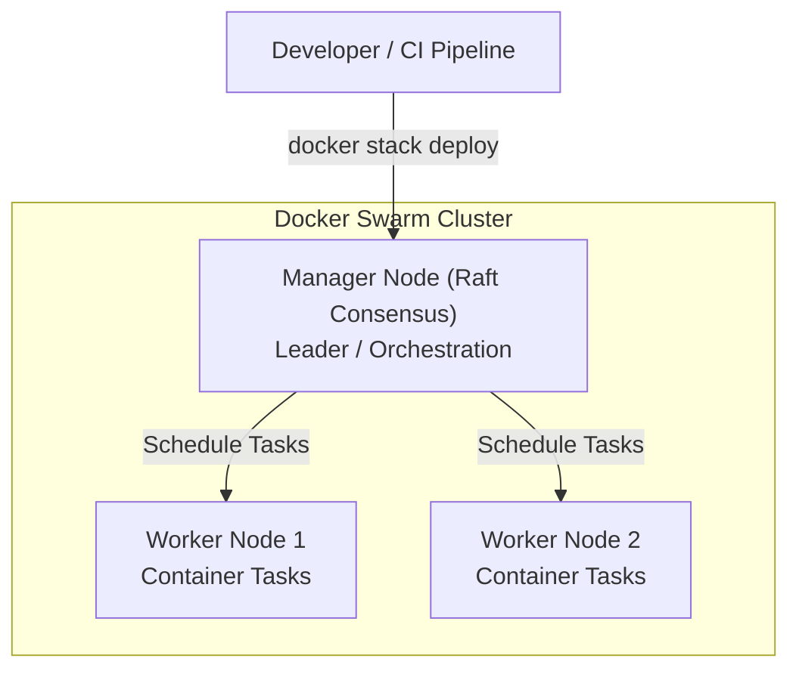

# ⚡ အခန်း (၁) - Advanced Docker, Security & Docker Swarm

---

## ၁။ Rootless Docker (Root မဟုတ်သော လုံခြုံရေးမြင့် Docker Engine)

### 📌 ပုံမှန် Docker ၏ လုံခြုံရေး အားနည်းချက်
ပုံမှန်အားဖြင့် Docker Daemon (`dockerd`) သည် Linux Host စက်၏ **Root User (`UID 0`)** အခွင့်အရေးဖြင့် လည်ပတ်ပါသည်။  
အကယ်၍ Hacker တစ်ယောက်သည် Container အတွင်းရှိ Bug တစ်ခုခုမှတစ်ဆင့် **Container Escape (ထွက်ပေါက်)** ရှာတွေ့သွားပါက Host Machine တစ်ခုလုံး၏ Root အခွင့်အရေးကို ချက်ချင်း ရရှိသွားနိုင်ပါသည်။

### 🛡️ Rootless Docker ဆိုတာ ဘာလဲ?
Rootless Mode တွင် Docker Daemon အပါအဝင် Container အားလုံးသည် Host စက်၏ သာမန် User (Non-root user) တစ်ဦးအနေဖြင့်သာ အလုပ်လုပ်သည်။  
- Hacker က Container ကို ထိုးဖောက်နိုင်ခဲ့လျှင်ပင် Host OS ၏ Root 권한 မရရှိနိုင်သဖြင့် Server တစ်ခုလုံး ပျက်စီးသွားခြင်းမှ ကာကွယ်ပေးသည်။

### ⚙️ Rootless Docker စတင်အသုံးပြုပုံ (Linux):
```bash
# Docker rootless script ကို သာမန် user အနေဖြင့် run ခြင်း
dockerd-rootless-setuptool.sh install

# Environment variable ထည့်သွင်းခြင်း
export DOCKER_HOST=unix:///run/user/1000/docker.sock

# စစ်ဆေးခြင်း
docker info | grep -i rootless
# Result: Rootless: true
```

---

## ၂။ BuildKit Advanced Caching (စက္ကန့်ပိုင်းအတွင်း Build ပြီးစီးစေနည်း)

Production CI/CD Pipeline များတွင် Docker Build ကြာမြင့်ခြင်းသည် Developer များအတွက် အချိန်ဖြုန်းတီးမှု ကြီးမားစေသည်။ Docker BuildKit ၏ Advanced Cache Mounts များကို အသုံးပြု၍ Build Speed ကို ၁၀ ဆ မြန်ဆန်အောင် ပြုလုပ်နိုင်ပါသည်။

### 🚀 Cache Mounts ဖြင့် Composer / NPM ကို အရှိန်မြှင့်ခြင်း

```dockerfile
# syntax=docker/dockerfile:1.4
FROM php:8.3-fpm-alpine

WORKDIR /var/www/html

# Composer cache folder ကို Host စက်၏ ယာယီ cache နှင့် တိုက်ရိုက် mount ချိတ်ခြင်း
# Container အသစ် build တိုင်း composer packages များကို အင်တာနက်မှ အစအဆုံး ပြန်မဒေါင်းတော့ပါ!
RUN --mount=type=cache,target=/root/.composer/cache \
    composer install --no-dev --optimize-autoloader
```

### ☁️ GitHub Actions တွင် Registry Cache Backend သုံးနည်း
CI/CD Pipeline တစ်ခုစီသည် Clean Runner စက်များတွင် run သဖြင့် Local cache မရှိတတ်ပါ။ ထို့ကြောင့် Remote Registry Cache ကို အသုံးပြုသည်-

```bash
docker buildx build \
  --cache-from=type=registry,ref=myusername/laravel-app:buildcache \
  --cache-to=type=registry,ref=myusername/laravel-app:buildcache,mode=max \
  -t myusername/laravel-app:latest --push .
```

---

## ၃။ Container Hardening & Security Profiling

Production Container တစ်ခုကို အလုံခြုံဆုံးဖြစ်အောင် သော့ခတ် (Harden) သည့် နည်းလမ်း ၃ မျိုး-

### ၁။ Linux Capabilities များကို ဖြုတ်ချခြင်း (`--cap-drop`)
Container များသည် ပုံမှန်အားဖြင့် မလိုအပ်သော Linux Kernel Capabilities များ ပါရှိနေတတ်သည်။ အကုန်ဖြုတ်ချပြီး လိုအပ်သည်ကိုသာ ပြန်ဖွင့်ပေးရမည်:

```bash
docker run -d \
  --cap-drop=ALL \
  --cap-add=NET_BIND_SERVICE \
  -p 80:80 \
  nginx:alpine
```
*(အားလုံးကို Drop လုပ်လိုက်ပြီး Port 80 ချိတ်ဆက်ရန် `NET_BIND_SERVICE` တစ်ခုတည်းကိုသာ ပြန်ပေးထားခြင်း ဖြစ်သည်)*

### ၂။ Seccomp (Secure Computing Mode)
Container က Linux Kernel ဆီသို့ ခေါ်ယူနိုင်သော System Calls (syscalls) များကို ကန့်သတ်ခြင်း ဖြစ်သည်။
```bash
docker run --security-opt seccomp=/path/to/custom-seccomp.json nginx:alpine
```

### ၃။ Read-Only Root Filesystem
```bash
docker run --read-only --tmpfs /tmp --tmpfs /var/run nginx:alpine
```
*(Hacker က Container ထဲသို့ Trojan/Webshell Script များ လာရောက် ဒေါင်းလုဒ်ဆွဲ ရေးသား၍ လုံးဝ မရနိုင်တော့ပါ)*

---

## ၄။ Docker Swarm (Native Clustering & Orchestration)

Kubernetes မတိုင်မီ Docker ၏ မူလ Native Clustering Tool ဖြစ်သော **Docker Swarm** ကို အခြေခံ နားလည်ထားရန် လိုအပ်ပါသည်။



### 📌 Swarm ၏ အဓိက သဘောတရားများ:
- **Manager Nodes:** Cluster ၏ အခြေအနေကို စီမံပြီး Worker Node များဆီသို့ အလုပ်များ ခွဲဝေပေးသည် (Raft Consensus Algorithm သုံးသည်)။
- **Worker Nodes:** Container (Tasks) များကို အမှန်တကယ် Run ပေးသည့် စက်များ ဖြစ်သည်။
- **Routing Mesh (Ingress Network):** မည်သည့် Node ၏ Port သို့ Request ရောက်လာသည်ဖြစ်စေ Service အမှန်တကယ် Run နေသော Node ဆီသို့ အလိုအလျောက် Forward လုပ်ပေးသည်။

### 🛠️ Docker Swarm စမ်းသပ်ခြင်း:
```bash
# ၁။ လက်ရှိစက်ကို Swarm Manager အဖြစ် စတင်ခြင်း
docker swarm init

# ၂။ Laravel Stack ကို Cluster ပေါ်သို့ Replicas 3 ခုဖြင့် Deploy လုပ်ခြင်း
docker stack deploy -c docker-compose.yml my-laravel-stack

# ၃။ Services စာရင်း စစ်ဆေးခြင်း
docker service ls

# ၄။ Traffic တက်လာပါက Service ကို ချက်ချင်း Scale လုပ်ခြင်း
docker service scale my-laravel-stack_php=5
```
