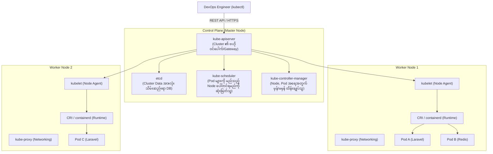

# ☸️ အခန်း (၂) - Kubernetes Fundamentals & Architecture

---

## ၁။ Kubernetes (K8s) ဆိုတာ ဘာလဲ? အဘယ်ကြောင့် လိုအပ်သနည်း?

### 📌 Docker Compose နှင့် မလုံလောက်တော့သော အခြေအနေများ
Docker Compose သည် စက်တစ်လုံးတည်း (Single Server) တွင် Development လုပ်ရန် အလွန်ကောင်းမွန်ပါသည်။ သို့သော် Production သို့ ရောက်သောအခါ အောက်ပါ ပြဿနာများကို ရင်ဆိုင်ရသည်-
- **Server ပျက်ကျခြင်း (High Availability):** သင့် Docker Server ကြီး မီးပျက်သွားလျှင် သို့မဟုတ် Hardware ပျက်သွားလျှင် Web Application တစ်ခုလုံး သေသွားမည်။ Server ပေါင်း ဆယ်ချီ၊ ရာချီပေါ်တွင် ခွဲဝေ Run ရန် လိုအပ်လာသည်။
- **Auto-Scaling (အလိုအလျောက် တိုးချဲ့ခြင်း):** ညနေ ၈ နာရီ Traffic အများဆုံးအချိန်တွင် Container အလုံး ၅၀ လိုအပ်ပြီး၊ ညသန်းခေါင်တွင် ၂ လုံးသာ လိုအပ်ပါက အလိုအလျောက် ချိန်ညှိပေးနိုင်ရမည်။
- **Self-Healing (အလိုအလျောက် ပြန်လည်ကုသခြင်း):** Container တစ်ခုခု Crash ဖြစ်သွားပါက လူမသိစေဘဲ စက္ကန့်ပိုင်းအတွင်း အသစ်ချက်ချင်း အလိုအလျောက် အစားထိုး မွေးဖွားပေးရမည်။
- **Zero-Downtime Rolling Updates:** Code အသစ် Deploy လုပ်ချိန်တွင် User များ Connection ပြတ်တောက်မှု လုံးဝ မရှိစေရပါ။

**ဤပြဿနာ အားလုံးကို ဖြေရှင်းရန် Google က တီထွင်ပြီး ယခု CNCF (Cloud Native Computing Foundation) မှ ထိန်းကျောင်းပေးနေသော ကမ္ဘာ့နံပါတ်တစ် Container Orchestrator မှာ "Kubernetes" (K8s) ဖြစ်သည်။**

---

## ၂။ Kubernetes Architecture (ဖွဲ့စည်းပုံ စနစ်ကြီး)

Kubernetes Cluster တစ်ခုတွင် **Control Plane (ဦးနှောက်စနစ်)** နှင့် **Worker Nodes (လုပ်သားစက်များ)** ဟူ၍ အဓိက ၂ ပိုင်း ခွဲခြားထားသည်။



---

### 🧠 Control Plane Components (ဦးနှောက် အစိတ်အပိုင်းများ)

1. **`kube-apiserver`:**
   - Kubernetes ၏ ဗဟို အချက်အချာ မျက်နှာစာ ဖြစ်သည်။
   - `kubectl` command များ၊ Worker Nodes များ၊ ပြင်ပ Controller များ အားလုံးသည် API Server မှတစ်ဆင့်သာ ဆက်သွယ်ရသည်။
2. **`etcd`:**
   - အလွန်မြန်ဆန်သော Distributed Key-Value Store ဖြစ်သည်။
   - Cluster အတွင်းရှိ Pods, Configs, Secrets, Deployments အချက်အလက် အားလုံး၏ တစ်ခုတည်းသော Single Source of Truth အဖြစ် သိမ်းဆည်းထားသည်။
3. **`kube-scheduler`:**
   - အသစ်ဆောက်မည့် Pod များကို စောင့်ကြည့်ပြီး မည်သည့် Worker Node တွင် CPU/RAM အားလပ်နေသလဲ၊ Node Affinity စည်းကမ်းချက်များနှင့် ကိုက်ညီသလဲကို တွက်ချက်ကာ အသင့်တော်ဆုံး Node ပေါ်သို့ နေရာချပေးသည်။
4. **`kube-controller-manager`:**
   - Cluster ၏ လက်ရှိအခြေအနေ (Current State) သည် သင် အလိုရှိသော အခြေအနေ (Desired State) နှင့် တူ/မတူ အမြဲ စစ်ဆေးနေသော Loop Controller ဖြစ်သည် (ဥပမာ- Pod ၃ လုံး Run ရန် ပြောထားပြီး ၁ လုံး သေသွားပါက အသစ် ၁ လုံး ချက်ချင်း ပြန်ဆောက်ပေးသည်)။

---

### 🚜 Worker Node Components (လုပ်သား စက်များပေါ်ရှိ အစိတ်အပိုင်းများ)

1. **`kubelet`:**
   - Worker Node တစ်ခုစီတိုင်းတွင် အမြဲ အလုပ်လုပ်နေသော Node Agent ဖြစ်သည်။
   - Control Plane ထံမှ အမိန့်များကို လက်ခံပြီး Container Runtime (containerd) ကို ခေါ်ကာ Pod များကို စတင် Run စေခြင်း၊ ကျန်းမာရေး စောင့်ကြည့်ခြင်း ပြုလုပ်သည်။
2. **`kube-proxy`:**
   - Node တစ်ခုချင်းစီ၏ Network Proxy ဖြစ်ပြီး Linux `iptables` သို့မဟုတ် `IPVS` များကို အသုံးပြု၍ Pod အချင်းချင်း Network လမ်းကြောင်းများနှင့် Service IP များကို လမ်းကြောင်းလွှဲပေးသည်။
3. **Container Runtime (CRI):**
   - Container များကို အမှန်တကယ် Run ပေးသည့် အောက်ခြေ Engine ဖြစ်သည် (ယခုအခါ Docker အစား ပိုမိုပေါ့ပါးသော `containerd` သို့မဟုတ် `CRI-O` ကို စံနှုန်းအဖြစ် သုံးသည်)။

---

## ၃။ Pod ဆိုတာ ဘာလဲ? (The Atom of Kubernetes)

Kubernetes တွင် Container တစ်လုံးတည်းကို သီးသန့် Run ခြင်း မရှိပါ။ **"Pod"** ဟုခေါ်သော အသေးဆုံး ယူနစ်အတွင်းသို့ Container များကို ထည့်သွင်းပြီးမှသာ Run ပါသည်။

```
+-------------------------------------------------------------+
|                           POD                               |
|  IP Address: 10.244.1.15 (Shared)                           |
|                                                             |
|   +--------------------------+  +------------------------+  |
|   | Container 1:             |  | Container 2 (Sidecar): |  |
|   | Laravel PHP-FPM (Port 9000)| | Nginx (Port 80)       |  |
|   +--------------------------+  +------------------------+  |
|                 |                           |               |
|                 +------------+--------------+               |
|                              |                              |
|                   [ Shared Localhost Network ]              |
|                   [ Shared Storage Volumes   ]              |
+-------------------------------------------------------------+
```

### 💡 Pod တစ်ခုအတွင်းရှိ Containers များ၏ အထူးအခွင့်အရေးများ:
1. **Shared IP Address:** Pod တစ်ခုလုံးတွင် IP Address တစ်ခုတည်းသာ ရှိသည်။
2. **Shared Localhost:** Container 1 (Nginx) သည် Container 2 (PHP-FPM) ကို `localhost:9000` ဟု ရိုးရှင်းစွာ လှမ်းခေါ်နိုင်သည်။
3. **Shared Volumes:** Pod အတွင်းရှိ Container အချင်းချင်း File များကို Volume မျှဝေ ဖတ်/ရေး ပြုလုပ်နိုင်သည်။

---

## ၄။ `kubectl` Essential Commands Cheat Sheet

`kubectl` သည် Kubernetes Cluster ကို ထိန်းချုပ်ရန် တရားဝင် Command Line Tool ဖြစ်သည်။

| Command | ရည်ရွယ်ချက် | ဥပမာ |
| :--- | :--- | :--- |
| **`kubectl get`** | Resource စာရင်းများကို ကြည့်ရှုရန် | `kubectl get pods -n production` |
| **`kubectl describe`** | Resource တစ်ခု၏ အသေးစိတ် အချက်အလက်နှင့် Events (Error history) ကို စစ်ဆေးရန် | `kubectl describe pod laravel-app-7b9f8` |
| **`kubectl logs`** | Pod အတွင်းရှိ Container ၏ Log များကို ကြည့်ရန် | `kubectl logs -f laravel-app-7b9f8 -c php` |
| **`kubectl exec`** | Pod အတွင်းသို့ Terminal ဝင်ရောက်ရန် | `kubectl exec -it laravel-app-7b9f8 -- bash` |
| **`kubectl apply`** | YAML Manifest ဖိုင်ကို Cluster ပေါ်သို့ တင်သွင်းရန် | `kubectl apply -f deployment.yaml` |
| **`kubectl delete`** | Resource တစ်ခုကို ဖျက်ပစ်ရန် | `kubectl delete pod laravel-app-7b9f8` |
| **`kubectl top`** | Pod / Node များ၏ Live CPU နှင့် Memory သုံးစွဲမှုကို ကြည့်ရန် | `kubectl top pods` |
