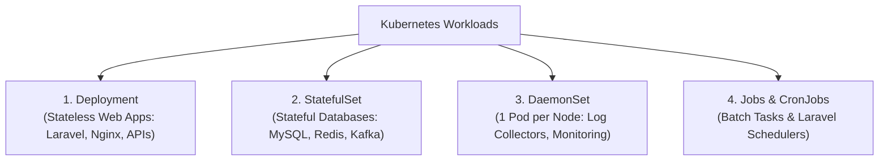

# 🚀 အခန်း (၃) - Kubernetes Workloads: Deployments & StatefulSets

---

## ၁။ Production တွင် Pod တစ်လုံးတည်း သီးသန့် အဘယ်ကြောင့် မ Run သင့်သနည်း?

အကယ်၍ သင်သည် `Pod` တစ်ခုတည်းကို Create လုပ်ထားပါက-
- အဆိုပါ Pod Run နေသော Worker Node စက် ပျက်ကျသွားလျှင် Pod သည် အလိုအလျောက် ပြန်မရှင်နိုင်တော့ပါ။
- ထို့ကြောင့် Kubernetes တွင် Pods များကို စီမံခန့်ခွဲပေးသော **Controllers (Workloads)** များကိုသာ အသုံးပြုရသည်။

---

## ၂။ Kubernetes Workload အမျိုးအစားများ နှိုင်းယှဉ်ချက်



---

## ၃။ Deployments (Stateless Applications အတွက် စံနှုန်း)

Laravel API သို့မဟုတ် Nginx Web Server ကဲ့သို့သော Stateless Application များအတွက် **Deployment** ကို အသုံးပြုသည်။

### 📄 Production Laravel Deployment YAML နမူနာ

```yaml
apiVersion: apps/v1
kind: Deployment
metadata:
  name: laravel-deployment
  namespace: production
  labels:
    app: laravel
spec:
  replicas: 3                        # Pod ၃ လုံး အမြဲ Run ထားမည်
  strategy:
    type: RollingUpdate
    rollingUpdate:
      maxSurge: 1                    # Update လုပ်ချိန်တွင် ပိုမိုဆောက်ခွင့်ပြုသော အရေအတွက် (1 လုံး)
      maxUnavailable: 0              # Update လုပ်ချိန်တွင် မည်သည့် Pod မှ အလုပ်မပြတ်တောက်စေရ (Zero-Downtime)
  selector:
    matchLabels:
      app: laravel
  template:
    metadata:
      labels:
        app: laravel
    spec:
      containers:
        - name: laravel-app
          image: ghcr.io/mycompany/laravel-app:v1.2.0
          imagePullPolicy: IfNotPresent
          ports:
            - containerPort: 9000
          resources:
            requests:
              cpu: "100m"            # 0.1 CPU core
              memory: "128Mi"
            limits:
              cpu: "500m"            # 0.5 CPU core
              memory: "512Mi"
          envFrom:
            - configMapRef:
                name: laravel-config
            - secretRef:
                name: laravel-secrets
```

---

## ၄။ StatefulSets (Databases & Caches အတွက်)

Database များ (MySQL, PostgreSQL, Redis) သည် Pod နာမည် ပြောင်းလဲ၍ မရခြင်း၊ တစ်ခုချင်းစီအတွက် သီးသန့် Persistent Disk ပိုင်ဆိုင်ရန် လိုအပ်ခြင်းတို့ကြောင့် **StatefulSet** ကို အသုံးပြုသည်။

| အချက်အလက် | Deployment | StatefulSet |
| :--- | :--- | :--- |
| **Pod အမည်များ** | Random Hash (`laravel-app-7b9f8-x4z2p`) | စဉ်ဆက်မပြတ် သတ်မှတ်ထားသော Index (`mysql-0`, `mysql-1`) |
| **Storage (Disk)** | အားလုံး အတူတူ သုံးသည် (သို့မဟုတ် Disk မလိုပါ) | Pod တစ်ခုစီအတွက် သီးသန့် Disk တစ်ခုစီ ပိုင်ဆိုင်သည် (`volumeClaimTemplates`) |
| **Scale & Shutdown** | အားလုံး တစ်ပြိုင်နက် ရပ်တန့်နိုင်သည် | စနစ်တကျ နောက်ဆုံးနံပါတ်မှ စတင်၍ တစ်လုံးချင်း ပိတ်သိမ်းသည် |

---

## ၅။ DaemonSets (Node တစ်ခုလျှင် Pod တစ်လုံး မဖြစ်မနေ Run စေခြင်း)

Cluster ထဲသို့ Worker Node စက် အသစ်တစ်လုံး ဝင်လာတိုင်း အဆိုပါ Node ပေါ်တွင် အလိုအလျောက် သွားရောက် Run စေလိုသော Service များအတွက် **DaemonSet** ကို သုံးသည်:
- **Logging Agents:** Promtail / Fluentd / Fluent Bit (Node ပေါ်ရှိ Log အားလုံးကို စုဆောင်းရန်)
- **Monitoring Agents:** Prometheus Node Exporter (စက်၏ CPU/RAM အခြေအနေကို စောင့်ကြည့်ရန်)

---

## ၆။ Jobs & CronJobs (Laravel Scheduler & DB Backups)

### ⏱️ Laravel Schedule အတွက် Kubernetes CronJob

Laravel ၏ `php artisan schedule:run` ကို ၁ မိနစ်လျှင် တစ်ကြိမ် ပုံမှန် Run စေလိုပါက Kubernetes **CronJob** ဖြင့် အောက်ပါအတိုင်း အလွယ်တကူ တည်ဆောက်နိုင်သည်:

```yaml
apiVersion: batch/v1
kind: CronJob
metadata:
  name: laravel-scheduler
  namespace: production
spec:
  schedule: "* * * * *"             # ၁ မိနစ်လျှင် တစ်ကြိမ်
  successfulJobsHistoryLimit: 3
  failedJobsHistoryLimit: 3
  jobTemplate:
    spec:
      template:
        spec:
          restartPolicy: OnFailure
          containers:
            - name: artisan-schedule
              image: ghcr.io/mycompany/laravel-app:v1.2.0
              command: ["php", "artisan", "schedule:run"]
```
