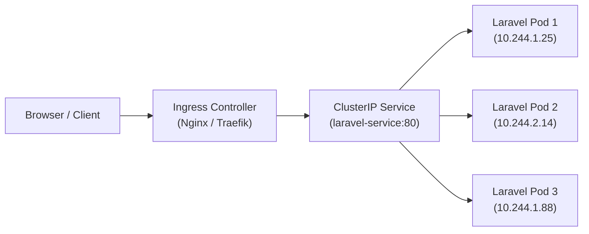

# 🌐 အခန်း (၄) - Networking, Services & Ingress (SSL/TLS)

---

## ၁။ Pod IPs are Ephemeral (Service ဘာကြောင့် လိုအပ်သနည်း?)

Kubernetes တွင် Pod တစ်ခုသည် Restart ဖြစ်သွားတိုင်း သို့မဟုတ် Node အသစ်ပေါ်သို့ ရွှေ့သွားတိုင်း **IP Address အသစ် အလိုအလျောက် ပြောင်းလဲသွားပါသည်**။  
ထို့ကြောင့် Database သို့မဟုတ် Backend Pod များကို IP ဖြင့် လှမ်းချိတ်ပါက ချိတ်ဆက်မှု မကြာခဏ ပြတ်တောက်ပါမည်။

ဤပြဿနာကို ဖြေရှင်းရန် **Kubernetes Service** ကို အသုံးပြုသည်။ Service သည် Pods များ၏ ရှေ့တွင် ခိုင်မာသော **Static Virtual IP နှင့် DNS Name** တစ်ခုကို တည်ဆောက်ပေးပြီး Traffic များကို နောက်ကွယ်ရှိ ကျန်းမာသော Pods များထံ Load Balance လုပ်ပေးသည်။



---

## ၂။ Kubernetes Service အမျိုးအစား ၃ မျိုး

| Service Type | အသုံးပြုပုံ | အသုံးပြုသော နေရာ |
| :--- | :--- | :--- |
| **`ClusterIP` (Default)** | Cluster အတွင်းပိုင်း၌သာ ခေါ်ယူနိုင်သော သီးသန့် Private IP ပေးသည် | Database (MySQL), Cache (Redis), Internal Microservices |
| **`NodePort`** | Worker Node တိုင်း၏ တိကျသော Port (`30000-32767`) ပေါ်တွင် ဖွင့်လှစ်ပေးသည် | On-Premise သို့မဟုတ် Ingress Controller ၏ ဝင်ပေါက်အတွက် |
| **`LoadBalancer`** | Cloud Provider (AWS, Google Cloud, Azure) ထံမှ Public Cloud Load Balancer အစစ်အမှန်ကို တိုက်ရိုက် တောင်းယူပေးသည် | Cloud ပေါ်ရှိ Public Entrypoint များအတွက် |

### 📄 Laravel ClusterIP Service YAML နမူနာ:
```yaml
apiVersion: v1
kind: Service
metadata:
  name: laravel-service
  namespace: production
spec:
  type: ClusterIP
  selector:
    app: laravel
  ports:
    - name: http
      port: 80
      targetPort: 80
```

---

## ၃။ Ingress Controller (Production Reverse Proxy & Routing)

Service တစ်ခုချင်းစီအတွက် Cloud Load Balancer ဆောက်ပါက ကုန်ကျစရိတ် အလွန် ကြီးမားပါသည်။ (Load Balancer တစ်ခုလျှင် တစ်လ $20 ခန့် ကုန်ကျသည်)။  
**Ingress** သည် Cloud Load Balancer တစ်ခုတည်းဖြင့် Domain Name ပေါင်းများစွာ (ဥပမာ- `api.example.com`, `app.example.com`, `admin.example.com`) ကို Layer 7 (HTTP/HTTPS) အဆင့်တွင် လမ်းကြောင်းခွဲ (Routing) ပေးနိုင်သော စနစ် ဖြစ်သည်။

### 📄 Production Ingress YAML (Automatic SSL/TLS ပါဝင်ပြီး)

```yaml
apiVersion: networking.k8s.io/v1
kind: Ingress
metadata:
  name: laravel-ingress
  namespace: production
  annotations:
    # Nginx Ingress Controller အား ညွှန်ကြားခြင်း
    kubernetes.io/ingress.class: "nginx"
    # Cert-Manager အား Let's Encrypt မှ SSL Certificate အလိုအလျောက် ထုတ်ယူစေခြင်း
    cert-manager.io/cluster-issuer: "letsencrypt-prod"
    nginx.ingress.kubernetes.io/proxy-body-size: "64m"
spec:
  tls:
    - hosts:
        - mylaravelapp.com
      secretName: laravel-tls-secret     # SSL Certificate အား ဤ Secret ထဲတွင် အလိုအလျောက် သိမ်းမည်
  rules:
    - host: mylaravelapp.com
      http:
        paths:
          - path: /
            pathType: Prefix
            backend:
              service:
                name: laravel-service
                port:
                  number: 80
```

---

## ၄။ NetworkPolicies (Kubernetes အတွင်းပိုင်း Firewall)

ပုံမှန်အားဖြင့် Kubernetes Cluster အတွင်းရှိ Pod တိုင်းသည် အခြား Pod အားလုံးဆီသို့ တိုက်ရိုက် ချိတ်ဆက်ခွင့် ရှိနေပါသည်။  
လုံခြုံရေးအရ Database (MySQL) ဆီသို့ Laravel Backend Pod များမှ လွဲ၍ အခြား မည်သည့် Pod ကမျှ တိုက်ရိုက် လှမ်းချိတ်၍ မရအောင် **NetworkPolicy** ဖြင့် ပိတ်ပင်ထားရမည်:

```yaml
apiVersion: networking.k8s.io/v1
kind: NetworkPolicy
metadata:
  name: allow-laravel-to-mysql
  namespace: production
spec:
  podSelector:
    matchLabels:
      app: mysql
  ingress:
    - from:
        - podSelector:
            matchLabels:
              app: laravel
      ports:
        - protocol: TCP
          port: 3306
```
*(ယခုအခါ Laravel Pod မဟုတ်သော အခြား မည်သည့် Pod ကမျှ MySQL Port 3306 သို့ လှမ်းဆက်သွယ်၍ မရတော့ပါ)*
