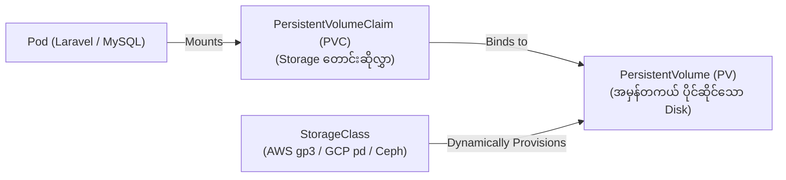

# 💾 အခန်း (၅) - Storage (PV/PVC) & Configuration (ConfigMaps/Secrets)

---

## ၁။ Kubernetes Storage စနစ် (PV, PVC & StorageClass)

Container များ ပျက်စီးသွားသော်လည်း Data များ မပျောက်ပျက်စေရန် Kubernetes တွင် Storage အဆင့် ၃ ဆင့်ဖြင့် စီမံသည်-



1. **`StorageClass`:** Cloud Provider (AWS EBS, GCP Persistent Disk, NFS) ထံမှ Disk အမျိုးအစားများကို Dynamic အလိုအလျောက် ထုတ်ပေးသော စက်ရုံကြီး ဖြစ်သည်။
2. **`PersistentVolume (PV)`:** Cluster တွင် အမှန်တကယ် ရှိနေသော Disk အပိုင်းအစ (Storage Asset) ဖြစ်သည်။
3. **`PersistentVolumeClaim (PVC)`:** Developer သို့မဟုတ် Pod က "ကျွန်တော့် MySQL အတွက် Disk Size 20GB လိုအပ်ပါသည်" ဟု ရေးသားတင်ပြသော တောင်းဆိုလွှာ ဖြစ်သည်။

---

### 📄 MySQL အတွက် PVC နမူနာ:
```yaml
apiVersion: v1
kind: PersistentVolumeClaim
metadata:
  name: mysql-pvc
  namespace: production
spec:
  accessModes:
    - ReadWriteOnce             # Node တစ်ခုတည်းကသာ Read/Write ပြုလုပ်ခွင့်ရှိသည်
  storageClassName: "gp3"       # AWS gp3 fast SSD storage class
  resources:
    requests:
      storage: 20Gi
```

### 🔑 Storage Access Modes ၃ မျိုး
- **`ReadWriteOnce (RWO)`**: Node တစ်ခုတည်းကသာ Disk ကို တွဲဆက်နိုင်သည် (Database များအတွက် အကောင်းဆုံး)။
- **`ReadOnlyMany (ROX)`**: Node ပေါင်းများစွာက Read-Only ဖတ်ရှုခွင့် ရှိသည်။
- **`ReadWriteMany (RWX)`**: Node ပေါင်းများစွာပေါ်ရှိ Pod များက တစ်ပြိုင်နက် ဖတ်/ရေး ပြုလုပ်နိုင်သည် (Laravel Public Uploads များအတွက် AWS EFS / NFS ကဲ့သို့ Network File System သုံးရသည်)။

---

## ၂။ ConfigMaps (လျှို့ဝှက်မဟုတ်သော Config များ)

Application Environment Variables များကို Code ထဲတွင် မထည့်ဘဲ ConfigMap အဖြစ် ခွဲထုတ်သိမ်းဆည်းသည်။

```yaml
apiVersion: v1
kind: ConfigMap
metadata:
  name: laravel-config
  namespace: production
data:
  APP_ENV: "production"
  APP_DEBUG: "false"
  DB_HOST: "mysql-service"
  DB_PORT: "3306"
  DB_DATABASE: "laravel_db"
  REDIS_HOST: "redis-service"
```

---

## ၃။ Secrets (လျှို့ဝှက်ချက်များနှင့် Passwords စီမံခန့်ခွဲမှု)

Database Password, JWT Secret Key, AWS Keys စသည်တို့ကို **Secret** Resource ထဲတွင် သိမ်းဆည်းသည်။

```yaml
apiVersion: v1
kind: Secret
metadata:
  name: laravel-secrets
  namespace: production
type: Opaque
stringData:
  DB_PASSWORD: "SuperSecureProductionPassword123!"
  APP_KEY: "base64:AbCdEfGhIjKlMnOpQrStUvWxYz=="
```

### ⚠️ Base64 Security သတိပြုရန် & Modern Production Patterns
- Kubernetes Secret ၏ default Base64 သည် **Encryption (ဝှက်စာ) မဟုတ်ပါ**၊ Encode ပြုလုပ်ထားခြင်းသာ ဖြစ်သည်။ အလွယ်တကူ Decode ပြန်လုပ်၍ ရသည်။
- **Production Best Practices:**
  1. **External Secrets Operator (ESO):** AWS Secrets Manager သို့မဟုတ် HashiCorp Vault ထဲမှ တကယ့် Secret များကို K8s Cluster ထဲသို့ လုံခြုံစွာ အလိုအလျောက် ဆွဲယူအသုံးပြုခြင်း။
  2. **Sealed Secrets (GitOps Safe):** Secret ဖိုင်များကို Asymmetric Key ဖြင့် Encrypt လုပ်ထားသဖြင့် GitHub ပေါ်သို့ တွန့်ဆုတ်စရာမလိုဘဲ တင်ထားနိုင်ပြီး K8s Cluster ပေါ်ရောက်မှသာ Cluster Key ဖြင့် Decrypt ပြုလုပ်ပေးသည့် နည်းလမ်း။
