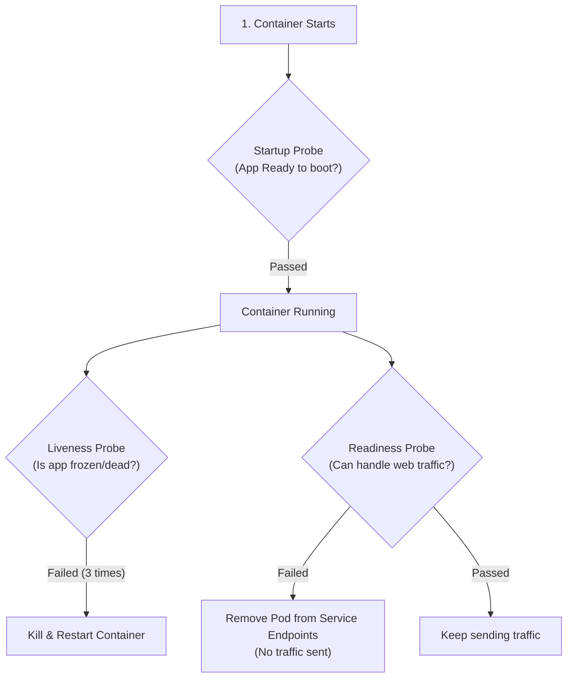
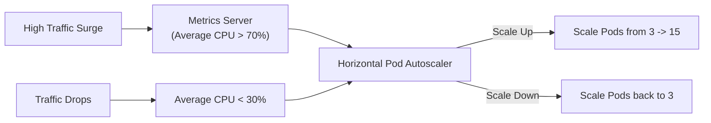

# 📈 အခန်း (၆) - Scaling, Self-Healing & Health Probes

---

## ၁။ Health Probes (Self-Healing စနစ်၏ နှလုံးသား)

Kubernetes သည် Container တစ်ခု အလုပ်လုပ်နိုင်ခြင်း ရှိ/မရှိကို Process အသက်ရှင်ရုံဖြင့် မဆုံးဖြတ်ပါ။ Container အတွင်းရှိ Laravel Application သည် Deadlock ဖြစ်နေခြင်း သို့မဟုတ် Database ပြတ်တောက်နေခြင်း ရှိ/မရှိ စစ်ဆေးရန် **Probes (ကျန်းမာရေးစစ်ဆေးမှု) ၃ မျိုး** ကို အသုံးပြုသည်။



### 🔍 Probes ၃ မျိုး ရှင်းလင်းချက်:

1. **`startupProbe`:** Application စတင်ချိန်တွင် Database connection ချိတ်ခြင်း၊ cache ဆောက်ခြင်း စသည့် နှေးကွေးသော အဆင့်များအတွက် အချိန်ပေးပြီး ဤ Probe အောင်မြင်မှသာ အောက်ပါ Probes များကို ဆက်စစ်ဆေးသည်။
2. **`livenessProbe`:** Application ကြီး Hang ဖြစ်သွားပါက သို့မဟုတ် Infinite Loop ဖြစ်သွားပါက Container အား သတ်ပစ်ပြီး အသစ် ပြန်စတင် (Restart) ပေးသည်။
3. **`readinessProbe`:** Laravel App သည် လက်ရှိတွင် CPU တက်နေ၍ Request အသစ် လက်မခံနိုင်သေးပါက Service မှ အဆိုပါ Pod သို့ Traffic ပို့ခြင်းကို ခေတ္တ ဖြတ်တောက်ထားပေးပြီး ပြန်ကောင်းလာမှသာ Traffic ပြန်ပို့ပေးသည်။

### 📄 Laravel 11/10 အတွက် Health Probe Config:
```yaml
containers:
  - name: laravel-app
    image: ghcr.io/mycompany/laravel-app:v1.2.0
    # Laravel 11 တွင် default ပါရှိသော /up route ကို စစ်ဆေးခြင်း
    readinessProbe:
      httpGet:
        path: /up
        port: 80
      initialDelaySeconds: 5
      periodSeconds: 5
      failureThreshold: 2
    livenessProbe:
      httpGet:
        path: /up
        port: 80
      initialDelaySeconds: 15
      periodSeconds: 10
      failureThreshold: 3
```

---

## ၂။ Resource Requests & Limits (OOMKilled ကာကွယ်ခြင်း)

Resource မသတ်မှတ်ထားသော Pod သည် Node စက်၏ Memory တစ်ခုလုံးကို ဝါးမျိုသွားပြီး အခြား Pod များကိုပါ သေစေနိုင်ပါသည်။

```yaml
resources:
  requests:
    cpu: "200m"          # 0.2 CPU Core (Scheduler က Node ပေါ်တွင် အာမခံ ဖယ်ပေးရမည့် ပမာဏ)
    memory: "256Mi"      # 256 MegaBytes
  limits:
    cpu: "1000m"         # 1 Core ထက် ပိုမသုံးစေရ (Throttled ဖြစ်မည်)
    memory: "512Mi"      # 512MB ကျော်ပါက Linux Kernel က OOMKilled (Out of Memory) ဖြင့် သတ်ပစ်မည်
```

---

## ၃။ Horizontal Pod Autoscaler - HPA (Traffic အလိုက် အလိုအလျောက် တိုး/လျှော့ခြင်း)

User များပြားလာသော အချိန်တွင် Pods များကို အလိုအလျောက် ပွားပေးပြီး User နည်းသွားပါက ပြန်လည် လျှော့ချပေးသော စနစ် ဖြစ်သည်။



### 📄 Production HPA YAML:
```yaml
apiVersion: autoscaling/v2
kind: HorizontalPodAutoscaler
metadata:
  name: laravel-hpa
  namespace: production
spec:
  scaleTargetRef:
    apiVersion: apps/v1
    kind: Deployment
    name: laravel-deployment
  minReplicas: 3                    # အနည်းဆုံး Pod ၃ လုံး အမြဲ ထားမည်
  maxReplicas: 15                   # အများဆုံး Pod ၁၅ လုံးအထိ တိုးခွင့်ပြုမည်
  metrics:
    - type: Resource
      resource:
        name: cpu
        target:
          type: Utilization
          averageUtilization: 70    # ပျမ်းမျှ CPU 70% ကျော်ပါက Pod အသစ် အလိုအလျောက် ပွားပေးမည်
    - type: Resource
      resource:
        name: memory
        target:
          type: Utilization
          averageUtilization: 80
```
