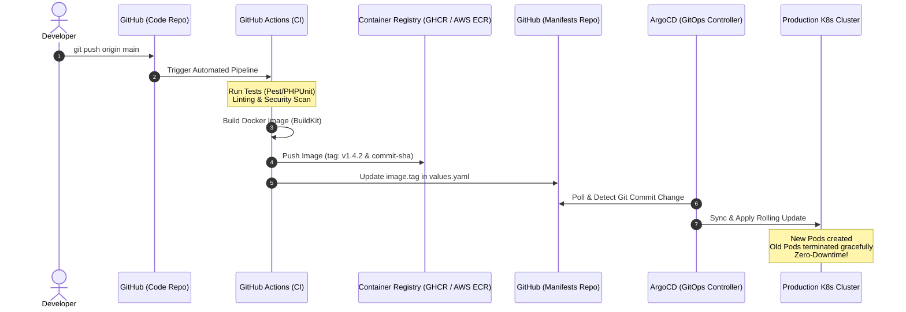

# 🔄 အခန်း (၈) - Real-World CI/CD & GitOps Workflow (ArgoCD & GitHub Actions)

---

## ၁။ Real-World Production Pipeline ကြီး၏ အလုပ်လုပ်ပုံ

ခေတ်မီ Tech Company ကြီးများတွင် Developer သည် Server ပေါ်သို့ Manual မည်သည့်အရာမှ ဝင်ရောက် လုပ်ဆောင်ခြင်း မရှိပါ။ အရာအားလုံးသည် **Automated CI/CD & GitOps** စနစ်ဖြင့် လည်ပတ်ပါသည်။



---

## ၂။ GitHub Actions CI Pipeline Configuration (`.github/workflows/deploy.yml`)

အောက်ပါ Pipeline သည် Developer က Git Push လုပ်လိုက်သည်နှင့် Test စစ်ခြင်း၊ Image Build လုပ်ခြင်းနှင့် Push တင်ခြင်းကို အလိုအလျောက် ပြုလုပ်ပေးသည်:

```yaml
name: Build, Test and Push Image

on:
  push:
    branches: [ "main" ]

jobs:
  test-and-build:
    runs-on: ubuntu-latest

    steps:
      - name: Checkout Code
        uses: actions/checkout@v4

      - name: Setup PHP & Composer
        uses: shivammathur/setup-php@v2
        with:
          php-version: '8.3'
          extensions: mbstring, pdo_mysql, redis

      - name: Run Tests
        run: |
          composer install -q --no-ansi --no-interaction --no-scripts --no-progress --prefer-dist
          php artisan test

      - name: Set up Docker Buildx
        uses: docker/setup-buildx-action@v3

      - name: Login to GitHub Container Registry
        uses: docker/login-action@v3
        with:
          registry: ghcr.io
          username: ${{ github.actor }}
          password: ${{ secrets.GITHUB_TOKEN }}

      - name: Build and Push Docker Image
        uses: docker/build-push-action@v5
        with:
          context: .
          push: true
          tags: |
            ghcr.io/${{ github.repository }}:latest
            ghcr.io/${{ github.repository }}:${{ github.sha }}
          cache-from: type=gha
          cache-to: type=gha,mode=max
```

---

## ၃။ GitOps ဆိုတာ ဘာလဲ? (Why ArgoCD?)

### ❌ ရိုးရာ Push-based CI/CD ၏ ပြဿနာ
ရိုးရာနည်းတွင် GitHub Actions က `kubectl apply` ဖြင့် Cluster ထဲသို့ ဝင်ရောက် Deploy လုပ်ရသဖြင့် GitHub Actions ထဲတွင် Kubernetes Cluster ၏ Admin Credentials (kubeconfig) ကို ထည့်သွင်းထားရသည်။ အကယ်၍ GitHub CI ပေါက်ကြားသွားပါက Cluster တစ်ခုလုံး အန္တရာယ် ကျရောက်နိုင်သည်။

### ✅ GitOps (Pull-based Model) ၏ အားသာချက်
- **ArgoCD** သည် Kubernetes Cluster အတွင်း၌သာ အလုပ်လုပ်သည်။
- မည်သည့် Admin Credential ကိုမျှ အပြင်သို့ မထုတ်ပေးရပါ။
- ArgoCD သည် GitHub ပေါ်ရှိ Kubernetes Manifests Repo ကို စက္ကန့်ပိုင်းခြား၍ အမြဲ စောင့်ကြည့်သည်။
- Git ပေါ်တွင် Manifest ပြောင်းလဲသွားသည်နှင့် Cluster ကို Git နှင့် တထေရာတည်း တူညီသွားအောင် **အလိုအလျောက် Pull ဆွဲ၍ Sync လုပ်ပေးသည်**။
- တစ်စုံတစ်ယောက်က Cluster ထဲတွင် လက်ဖြင့် ခိုးပြင်ပါက (Manual drift) ArgoCD က ချက်ချင်း သိရှိပြီး Git အတိုင်း မူလအတိုင်း ပြန်ပြင်ပေးသည်။

---

## ၄။ Production Deployment Strategies (Deploy လုပ်နည်း မဟာဗျူဟာများ)

### ၁။ Rolling Update (Kubernetes Default - Zero Downtime)
- Pod အဟောင်း ၃ လုံး ရှိလျှင် Pod အသစ် ၁ လုံးကို အရင်ဆောက်သည်။
- Pod အသစ် Healthcheck အောင်မြင်မှသာ Pod အဟောင်း ၁ လုံးကို ဖျက်သည်။
- ဤနည်းဖြင့် User များအတွက် ဝန်ဆောင်မှု လုံးဝ မပြတ်တောက်ဘဲ ဗားရှင်းအသစ်သို့ ချောမွေ့စွာ ကူးပြောင်းသွားသည်။

### ၂။ Blue/Green Deployment
- Version အဟောင်း (Blue) နှင့် Version အသစ် (Green) ကို Cluster ထဲတွင် တစ်ပြိုင်နက် သီးခြား Run ထားသည်။
- Green အားလုံး စမ်းသပ်စစ်ဆေးပြီး အဆင်ပြေမှသာ Ingress / Router ၏ ခလုတ်ကို ချက်ချင်း Green ဘက်သို့ လှည့်ပေးလိုက်သည်။
- အမှားတွေ့ပါက Blue ဘက်သို့ စက္ကန့်ပိုင်းအတွင်း ပြန်လှည့်နိုင်သည်။

### ၃။ Canary Deployment (Argo Rollouts)
- User အားလုံးဆီသို့ Version အသစ်ကို ချက်ချင်း မပေးသေးဘဲ **၅% သော User များဆီသို့သာ စမ်းသပ် လမ်းကြောင်းလွှဲပေးသည်**။
- Error Rate မတက်ပါက ၁၀% -> ၅၀% -> ၁၀၀% အဆင့်ဆင့် တိုးမြှင့်ပေးသွားသည့် အလုံခြုံဆုံး စနစ် ဖြစ်သည်။
