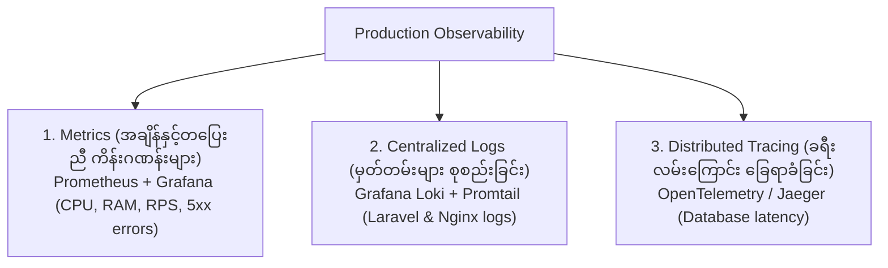

# 🩺 အခန်း (၉) - Monitoring, Logging & Production Troubleshooting

---

## ၁။ Production Observability (စနစ်တစ်ခုလုံးကို စောင့်ကြည့်တိုင်းတာခြင်း)

Production တွင် ပြဿနာဖြစ်မှ သိရခြင်းမျိုး မဖြစ်စေရန် အောက်ပါ **တိုင် ၃ တိုင် (Three Pillars of Observability)** ကို မဖြစ်မနေ တပ်ဆင်ရပါမည်:



### 📊 Prometheus & Grafana အလုပ်လုပ်ပုံ:
1. **Prometheus:** Worker Nodes များ၊ Kubernetes API နှင့် Laravel App မှ ထွက်ပေါ်လာသော Metrics (CPU %, Memory %, Request Duration) များကို စက္ကန့်ပိုင်းအလိုက် လှမ်းယူ (Scrape) သိမ်းဆည်းသည်။
2. **Grafana:** ထို Data များကို လှပသော Visual Dashboard အဖြစ် ဖော်ပြပေးသည်။
3. **Alertmanager:** CPU 85% ကျော်ခြင်း သို့မဟုတ် Error Rate မြင့်တက်လာပါက DevOps Team ၏ **Telegram / Slack / PagerDuty** ဆီသို့ ချက်ချင်း Alert ပို့ပေးသည်။

---

## ၂။ Production Troubleshooting (အဖြစ်များဆုံး K8s Error များနှင့် ဖြေရှင်းနည်းများ)

Kubernetes ကို စတင်ကိုင်တွယ်ချိန်တွင် အောက်ပါ Error များနှင့် မလွဲမသွေ ကြုံတွေ့ရမည် ဖြစ်သည်-

---

### 🔴 ၁။ `CrashLoopBackOff`
- **ဘာကြောင့် ဖြစ်သလဲ:** Container သည် စတင် Run ပြီးသည်နှင့် အကြောင်းတစ်ခုခုကြောင့် ချက်ချင်း ပျက်ကျ (Crash) သွားပြီး K8s က ထပ်ခါထပ်ခါ ပြန် restart လုပ်နေသော်လည်း အလုပ်မဖြစ်ခြင်း။
- **အဖြစ်များသော အကြောင်းအရင်းများ:**
  - Laravel `.env` ထဲတွင် Database Password မှားနေခြင်း။
  - PHP syntax error သို့မဟုတ် missing extension ဖြစ်နေခြင်း။
  - Entrypoint script တွင် permission မရှိခြင်း။
- **စစ်ဆေးနည်း:**
  ```bash
  # Pod ၏ Event log ကို စစ်ဆေးခြင်း
  kubectl describe pod <pod-name> -n production

  # အရင် Crash ဖြစ်သွားသော Container ၏ နောက်ဆုံး Error Log ကို ကြည့်ခြင်း
  kubectl logs <pod-name> --previous -n production
  ```

---

### 🔴 ၂။ `OOMKilled` (Exit Code 137)
- **ဘာကြောင့် ဖြစ်သလဲ:** Container သည် သတ်မှတ်ထားသော `resources.limits.memory` ပမာဏထက် ကျော်လွန်သုံးစွဲလိုက်သဖြင့် Linux Kernel က Process ကို ချက်ချင်း သတ်ပစ်လိုက်ခြင်း ဖြစ်သည်။
- **ဖြေရှင်းနည်း:**
  ```bash
  # Describe လုပ်ကြည့်ပါက "Last State: Terminated, Reason: OOMKilled" ဟု တွေ့ရမည်
  kubectl describe pod <pod-name>
  ```
  - Deployment YAML ထဲရှိ `resources.limits.memory` ကို ပမာဏ တိုးပေးပါ (ဥပမာ- `512Mi` မှ `1Gi` သို့)။
  - Laravel Code ထဲတွင် Memory Leak ဖြစ်နေသော Logic များ (ဥပမာ- DB query တွင် `chunk()` မသုံးဘဲ Record သောင်းချီ တစ်ပြိုင်နက် ဆွဲတင်ခြင်း) ကို ပြင်ဆင်ပါ။

---

### 🔴 ၃။ `ImagePullBackOff` / `ErrImagePull`
- **ဘာကြောင့် ဖြစ်သလဲ:** Kubernetes သည် Docker Image ကို Container Registry မှ ဒေါင်းလုဒ် ဆွဲမရခြင်း။
- **အဓိက အကြောင်းအရင်းများ:**
  - Image Name သို့မဟုတ် Version Tag စာလုံးပေါင်း မှားယွင်းနေခြင်း (ဥပမာ- `v1.2.0` အစား `v1.2` ဟု ရေးမိခြင်း)။
  - Private Registry (GHCR/AWS ECR) အတွက် `imagePullSecrets` မထည့်ပေးထားခြင်း။
- **ဖြေရှင်းနည်း:**
  ```bash
  kubectl describe pod <pod-name>
  # "Failed to pull image ... unauthorized" ဟု ပြပါက Secret စစ်ဆေးပါ
  ```

---

### 🔴 ၄။ `Pending` (Pod မတက်ဘဲ စောင့်ဆိုင်းနေခြင်း)
- **ဘာကြောင့် ဖြစ်သလဲ:** `kube-scheduler` သည် အဆိုပါ Pod ကို တင်ပေးရန် သင့်တော်သော Worker Node ရှာမတွေ့ခြင်း။
- **အဓိက အကြောင်းအရင်းများ:**
  - Worker Node များတွင် CPU သို့မဟုတ် RAM မလုံလောက်တော့ခြင်း (Cluster Resource Exhaustion)။
  - တောင်းဆိုထားသော PersistentVolumeClaim (PVC) မ bind နိုင်သေးခြင်း။
- **ဖြေရှင်းနည်း:**
  ```bash
  kubectl describe pod <pod-name>
  # Events တွင် "0/3 nodes are available: 3 Insufficient cpu" ဟု ပြပါက Node အရေအတွက် တိုးပေးရမည် (Cluster Autoscaler)
  ```

---

### 🛠️ Production Debugging Toolkit Commands:
```bash
# Cluster ပေါ်ရှိ Event အားလုံးကို နောက်ဆုံးဖြစ်ပျက်ခဲ့သည့် အချိန်အလိုက် စီတန်းကြည့်ခြင်း
kubectl get events -n production --sort-by='.metadata.creationTimestamp'

# Pod အတွင်း ဝင်၍ Network ပေါက်/မပေါက် စစ်ဆေးရန် ယာယီ Debug Pod ဖွင့်ခြင်း
kubectl run -it --rm debug-curl --image=curlimages/curl -- sh
```
