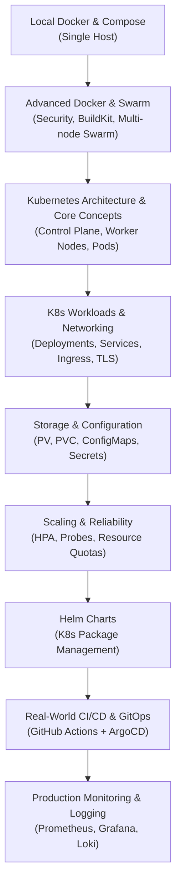

# 🚢 Advanced Docker, Kubernetes & Production Engineering (မြန်မာဘာသာ)

> **လုပ်ငန်းခွင်အစစ်အမှန် (Real-World Production Process) တွင် အသုံးပြုသော DevOps, Advanced Docker, Kubernetes (K8s) နှင့် GitOps CI/CD စနစ်များကို အဆင့်ဆင့် အသေးစိတ် ရှင်းလင်းထားသော လက်စွဲစာအုပ်**

---

## 🗺️ သင်ရိုး Roadmap (Learning Path)

ဤအပိုင်းသည် Single Container / Local Docker Compose အဆင့်မှသည် **High Availability (HA), Auto-Scaling, Multi-Node Kubernetes Clusters, GitOps CI/CD နှင့် Production Zero-Downtime Deployment** အဆင့်ထိ ကျွမ်းကျင်သွားစေရန် ရည်ရွယ်ပါသည်။

---

## 📚 အခန်းများ မာတိကာ (Chapters Overview)

| အခန်း | ဖိုင်အမည် | အဓိက ပါဝင်သော အကြောင်းအရာများ |
| :--- | :--- | :--- |
| **01** | [01-advanced-docker-and-swarm.md](file:///Users/kyawwaiyan/Documents/my-Home-tech/Docker-Course/advanced-docker-kubernetes-production/01-advanced-docker-and-swarm.md) | Rootless Docker, BuildKit Cache Optimization, Security Profiling (Seccomp, Capabilities), Docker Swarm Clustering |
| **02** | [02-kubernetes-fundamentals-and-architecture.md](file:///Users/kyawwaiyan/Documents/my-Home-tech/Docker-Course/advanced-docker-kubernetes-production/02-kubernetes-fundamentals-and-architecture.md) | K8s ဆိုတာဘာလဲ?၊ Control Plane vs Worker Nodes၊ API Server, etcd, Kubelet, Pod Lifecycle, kubectl Cheat Sheet |
| **03** | [03-k8s-workloads-deployments-and-statefulsets.md](file:///Users/kyawwaiyan/Documents/my-Home-tech/Docker-Course/advanced-docker-kubernetes-production/03-k8s-workloads-deployments-and-statefulsets.md) | Pods, ReplicaSets, Deployments, StatefulSets (MySQL/Redis), DaemonSets, Jobs & CronJobs (Laravel Scheduler) |
| **04** | [04-k8s-networking-services-and-ingress.md](file:///Users/kyawwaiyan/Documents/my-Home-tech/Docker-Course/advanced-docker-kubernetes-production/04-k8s-networking-services-and-ingress.md) | ClusterIP, NodePort, LoadBalancer, Nginx Ingress Controller, Automatic SSL/TLS with Cert-Manager (Let's Encrypt) |
| **05** | [05-k8s-storage-pv-pvc-and-config.md](file:///Users/kyawwaiyan/Documents/my-Home-tech/Docker-Course/advanced-docker-kubernetes-production/05-k8s-storage-pv-pvc-and-config.md) | StorageClass, PersistentVolumes (PV), PVC, ConfigMaps, Secrets Management (Sealed Secrets / External Secrets / Vault) |
| **06** | [06-scaling-self-healing-and-probes.md](file:///Users/kyawwaiyan/Documents/my-Home-tech/Docker-Course/advanced-docker-kubernetes-production/06-scaling-self-healing-and-probes.md) | Liveness, Readiness, Startup Probes, HPA (Horizontal Pod Autoscaler), Resource Requests & Limits, Self-Healing |
| **07** | [07-helm-charts-package-management.md](file:///Users/kyawwaiyan/Documents/my-Home-tech/Docker-Course/advanced-docker-kubernetes-production/07-helm-charts-package-management.md) | Helm ဆိုတာဘာလဲ?၊ Helm Templates, values.yaml, Custom Laravel Helm Chart ဖန်တီးခြင်းနှင့် Releases စီမံခြင်း |
| **08** | [08-real-world-cicd-gitops-workflow.md](file:///Users/kyawwaiyan/Documents/my-Home-tech/Docker-Course/advanced-docker-kubernetes-production/08-real-world-cicd-gitops-workflow.md) | **လုပ်ငန်းခွင် တကယ့် Workflow:** Git Push -> GitHub Actions (Build/Test/Push) -> ArgoCD (GitOps) -> Zero-Downtime Rolling Update |
| **09** | [09-production-monitoring-logging-and-troubleshooting.md](file:///Users/kyawwaiyan/Documents/my-Home-tech/Docker-Course/advanced-docker-kubernetes-production/09-production-monitoring-logging-and-troubleshooting.md) | Prometheus & Grafana Metrics, Loki Centralized Logging, Production Debugging (`CrashLoopBackOff`, `OOMKilled`, `ImagePullBackOff`) |
| **10** | [k8s-laravel-manifests/](file:///Users/kyawwaiyan/Documents/my-Home-tech/Docker-Course/advanced-docker-kubernetes-production/k8s-laravel-manifests) | တကယ့် Kubernetes Cluster ပေါ်တွင် Deploy လုပ်နိုင်သော Ready-to-Use Production Manifests (YAMLs) |

---

## 💼 Real-World DevOps Process ဆိုတာ ဘာလဲ?

ကုမ္ပဏီကြီးများနှင့် Enterprise Project များတွင် Developer သည် Server ထဲသို့ SSH ဝင်ပြီး Command များ ကိုယ်တိုင် မရိုက်ပါ-
1. **Developer:** Code ရေးပြီး Git ပေါ်သို့ `git push origin main` ပြုလုပ်သည်။
2. **CI Pipeline (GitHub Actions/GitLab CI):** Automated Tests စစ်ဆေးသည်၊ Docker Image ကို Build လုပ်ပြီး Container Registry (AWS ECR / Docker Hub) သို့ Tag ဖြင့် Push တင်သည်။
3. **GitOps Engine (ArgoCD / Flux):** Git Repository ရှိ Kubernetes Manifest အပြောင်းအလဲကို စောင့်ကြည့်ပြီး Production K8s Cluster သို့ Zero-Downtime ဖြင့် အလိုအလျောက် Deploy လုပ်ပေးသည်။
4. **Kubernetes Cluster:** Traffic များကို မပြတ်တောက်စေဘဲ Rolling Update လုပ်ပေးပြီး Pod အသစ်များ အဆင်သင့်ဖြစ်မှသာ User များထံ လမ်းကြောင်းလွှဲပေးသည်။
5. **Observability (Prometheus & Grafana):** Application ကျန်းမာရေး၊ CPU/RAM နှင့် Error logs များကို ၂၄ နာရီ စောင့်ကြည့်ပြီး Alert ပို့ပေးသည်။

အဆိုပါ စနစ်တစ်ခုလုံးကို အောက်ပါ သင်ခန်းစာများတွင် လက်တွေ့ ဥပမာများနှင့်တကွ အသေးစိတ် လေ့လာနိုင်ပါသည်။
